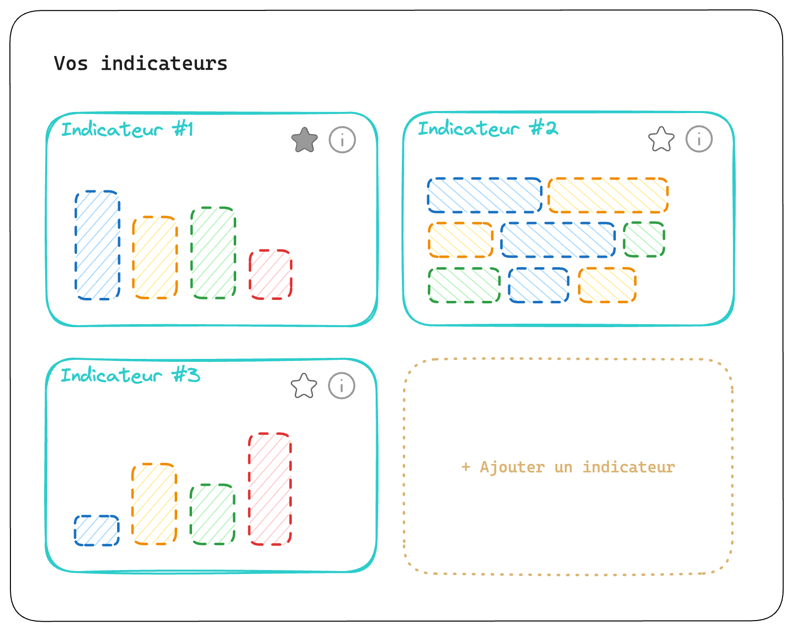

## Contexte

Dans le développement d'une application web, il est courant que le front-end et le back-end soient développés de
manière indépendante, parfois par deux équipes distinctes.
Il peut alors être difficile de se coordonner sur le développement des fonctionnalités.
En particulier, l'équipe front peut vite être bloquée par le manque de spécifications de l'API, de son implémentation
concrète ou encore de données suffisantes à consommer.

Il convient de se mettre d'accord rapidement sur les principes de fonctionnement du dialogue entre le client et le serveur,
en identifiant les besoins de chacun et en établissant un premier contrat d'API. Pour autant, la capacité de l'équipe 
back à fournir à temps tous les éléments nécessaires à ce que le front puisse avancer de façon autonome n'est pas 
toujours suffisante.

!!! Note ""
    À Elao, nombreuses de nos applications consistent en un back-end servant une API GraphQL construite avec le framework PHP
    [Symfony](../../term/symfony.md) et un front-end en [React](../../term/react.md) avec le client Apollo GraphQL.
    Il nous arrive également d'intervenir sur des projets uniquement sur le client front-end et devoir se coordonner avec
    une équipe back-end externe.

Dans ce contexte, il est intéressant de pouvoir simuler tout ou partie d'une API GraphQL, en minimisant le plus possible
les impacts sur le code fonctionnel du client front-end. C'est-à-dire en évitant l'introduction de dette technique
induite par **l'entremêlement du code fonctionnel avec du code visant à simuler les appels au serveur**. Code qu'il faudra
revoir avec plus ou moins de difficultés lorsque nous consommerons le véritable serveur.

C'est là qu'interviennent _les resolvers locaux Apollo_.

!!! danger "Comprendre le cache Apollo"
    La suite de cet article survole des connaissances quant au fonctionnement du cache avec le client GraphQL Apollo.  
    Si vous n'êtes pas tout-à-fait à l'aise avec ces principes, je vous invite à lire notre article sur le sujet: 
    [Comprendre le cache du client GraphQL Apollo](./apollo-graphql-cache.md).  
    L'article traite d'une ancienne version (2.x) d'Apollo, mais les principes restent les mêmes.

## Les resolvers locaux Apollo

Les resolvers locaux (ou resolvers client), sont une fonctionnalité du client
Apollo ([introduits en 2.5](https://www.apollographql.com/blog/announcing-apollo-client-2-5-c12230cabbb7#2-write-a-local-resolver-for-your-data))
permettant d'**interroger et manipuler un état local de votre application**, propre au client et sans lien direct avec
le serveur, comme vous pourriez le faire avec un store tel que Redux.  
À la différence que vous utiliserez des **queries et mutations GraphQL** ainsi que l'API Javascript du cache Apollo pour interagir 
avec cet état, de la même manière que vous si vous consommiez un serveur.

C'est cette homogénéité d'API qui va nous intéresser particulièrement, puisqu'elle va nous permettre de décrocher
facilement du code jusqu'alors uniquement client vers un échange client/serveur. 

Un `resolver` GraphQL est une fonction, d'ordinaire exécutée par le serveur, afin de résoudre un champ d'une requête GraphQL.

> A resolver is a function that's responsible for populating the data for a single field in your schema. It can populate
> that data in any way you define, such as by fetching data from a back-end database or a third-party API.  
> <cite>— [documentation Apollo server](https://www.apollographql.com/docs/apollo-server/data/resolvers)</cite>

Un resolver local est donc une fonction définie et exécutée uniquement par le client pour résoudre les champs d'une
requête GraphQL, annotés d'une directive spéciale : `@client`.

L'exemple donné par la documentation Apollo cherche à fournir un état local pour un panier d'achat, en ajoutant un flag
`isInCart` à une liste de produits. Cela permet de réaliser un système de panier sans avoir à exposer cette donnée sur
chaque produit côté serveur, ni dans un store Redux ou local storage complètement distinct de notre cache Apollo.

```graphql
query ProductDetails($productId: ID!) {
  product(id: $productId) {
    name
    price
    isInCart @client # <- 👀
  }
}
```

La **directive `@client`** sur le champ `isInCart` indique à Apollo de chercher un resolver local pour résoudre ce champ.
Ce champ ne sera par ailleurs **pas communiqué au serveur** dans la définition de la query lors de son exécution.

Le resolver pour `isInCart` peut être défini ainsi, au niveau du client Apollo:

```typescript
const client = new ApolloClient({
  cache: new InMemoryCache(),
  // …
  resolvers: {
    Product: {
      // On défini un resolver local pour le champ `isInCart` du type `Product`
      isInCart: (launch, _args, { cache }) => {
        // Récupère d'une façon quelconque les produits présents dans le panier
        const { cartItems } = // […];
        
        // puis retourne un booléen qui sera sauvegardé dans le cache
        return cartItems.includes(launch.id);
      },
    },
  },
});
```

Lors de l'exécution de la query `ProductDetails`, _qui est un mélange de champs distants et locaux_, Apollo récupère la
réponse du serveur, puis essaye de trouver un resolver local pour notre champ `isInCart` annoté avec la
directive `@client`.  
Si un resolver est trouvé, il est exécuté et le champ `isInCart` est **fusionné** avec la réponse du serveur dans le cache.

➜ Nos données distantes et locales cohabitent ainsi au sein d'**un seul et même store de données**.

_Découvrons maintenant comment nous pouvons utiliser cette fonctionnalité pour simuler tout ou partie d'une API GraphQL
et poursuivre nos développements front sans introduire de dette technique ni de code fonctionnel spécifique à retirer
une fois que nous consommerons le serveur._

## Cas d'usage

Nous illustrerons les cas d'usage suivants au travers d'une application exposant une page de liste d'indicateurs 
(KPI & graphiques) personnalisables (a.k.a `Widgets`).



Un utilisateur peut ainsi créer son tableau de bord en ajoutant et configurant des indicateurs à partir de modèles
pré-existants. Puis les organiser, supprimer, ou en mettre en favoris.

### Simuler une query de listing

Un resolver peut-être utilisé à **n'importe quel niveau du schéma GraphQL**.
Cela veut dire qu'il est possible de surcharger toute une query en définissant une directive `@client` sur celle-ci et
un resolver sur le champ correspondant de votre objet `ROOT_QUERY` (Généralement `Query`).

Par exemple, afin de simuler une requête pour obtenir la liste des indicateurs :

```graphql
# queries/getWidgets.graphql

query GetWidgets {
  # On annote la query avec la directive @client
  # pour indiquer qu'on souhaite utiliser un resolver local:
  getWidgets @client { # <- 👈🏻
    count
    rows {
      id
      name
      type
      position
      starred
      dataset
    }
  }
}
```

on définit une liste de resolvers qu'on passera à notre client Apollo :

```typescript
// client.ts
import resolvers from './resolvers';

const client = new ApolloClient({
  cache: new InMemoryCache(),
  resolvers,
});
```

et on définit le resolver pour le champ `getWidgets` de notre root `Query` :

```typescript
// resolvers.ts
import { type Resolvers } from '@apollo/client';
import { fakeWidgetsData } from './fake/widgets';

const resolvers = {
  Query: {
    getWidgets: fakeWidgetsData,
  },
} satisfies Resolvers;

export default resolvers;
```

🤲 Voici le code de notre resolver `fakeWidgetsData`:

```typescript
// hardcoded/widgets.ts

// Nos données simulées:
const FakeWidgets = [
  { id: 1, name: 'Widget 1', type: PIE, position: 0, starred: false, dataset: [/* … */] },
  // […]
];

export const fakeWidgetsData: Resolver = () => {
  // On retourne une structure correspondant au retour attendu par notre query:
  return {
    __typename: 'WidgetList',
    count: FakeWidgets.length,
    // Avec nos lignes de données simulées:
    rows: FakeWidgets,
  };
};
```

Enfin, nous consommerons cette query dans un composant React, comme nous le ferions pour communiquer avec le serveur:

```tsx
// ./pages/widgets.tsx

import { useQuery } from '@apollo/client';
import GET_WIDGETS from './queries/getWidgets.graphql';

export default function Widgets() {
  const { data } = useQuery(GET_WIDGETS);
    
  // `data.getWidgets` contient les données simulées
    
  return (
    // […]
  );
}
```

!!! Note ""
    Étant donné que nous avons choisi d'annoter l'ensemble de la query `getWidgets` avec la directive `@client`,
    **aucune requête ne sera envoyée au serveur**.  
    Apollo va directement chercher un resolver pour le champ `getWidgets` dans notre objet `Query` local et retourner 
    les données que nous lui avons fournies.

Le jour où nous souhaiterons consommer le serveur, **il suffira de retirer la directive `@client` de notre query**:

```diff
# queries/getWidgets.graphql

query GetWidgets {
-  getWidgets @client {
+  getWidgets {
    count
    rows {
      …
    }
  }
}
```

✅ La requête sera alors envoyée au serveur et notre resolver local ne sera plus utilisé.

➜ **Cette façon de faire possède ainsi l'avantage de ne pas nécessiter la moindre modification de notre code fonctionnel.**

### Simuler le retour d'une mutation

Imaginons que notre back-end ait défini la mutation pour mettre un widget en favoris, mais que cette fonctionnalité ne
soit pas implémentée. Le serveur accepte un appel à cette mutation, mais n'effectue aucun traitement ni ne retourne
encore aucune donnée.

L'équipe front aimerait néanmoins progresser sur cette fonctionnalité. Elle doit être capable :
- d'envoyer une mutation
- de réagir à la réponse pour refléter les changements dans l'interface 

_(à savoir, mettre à jour l'icône d'ajout en favoris et déplacer le widget en haut de liste)._


Sans que l'implémentation serveur ne soit complétée, nous pouvons fournir nous-mêmes le résultat de cette mutation en
usant de la directive `@client` :

```graphql
# mutations/toggleWidgetStarred.graphql

mutation toggleWidgetStarred($widgetId: ID!) {
  # Nous allons réellement exécuter cette mutation, 
  # mais utiliser un resolver local pour définir sa réponse.
  toggleWidgetStarred(widgetId: $widgetId) {
    # Sur chacun des champs concernés, on ajoute la directive @client:
    id @client
    starred @client
  }
}
```

Nous définissons un resolver local pour cette mutation:

```typescript
// resolvers.ts
import { toggleWidgetStar } from './fake/widgets';

const resolvers = {
  // […]
  Mutation: {
    toggleWidgetStar,
  },
} satisfies Resolvers;
```

Le resolver prend en paramètre quelques variables utiles, que nous allons utiliser pour générer notre réponse:

```typescript
export const toggleWidgetStar: Resolver = (_, variables, { cache }) => {
  // À partir des données existantes dans le cache, 
  // on va chercher le widget correspondant à l'ID fourni:
  const widget = cache.readFragment({
    id: cache.identify({
      __typename: 'Widget',
      id: variables.input.id,
    }),
    fragment: gql`
      fragment MyWidget on Widget {
        id
        starred
      }
    `,
  });

  // et retourner la réponse attendue avec la nouvelle valeur du champs `starred`:
  return {
    ...widget,
    starred: !(widget.starred ?? false),
  };
};
```

Non seulement nous pouvons alors utiliser cette mutation dans notre application, mais nous pouvons également réagir en
conséquence pour mettre à jour notre cache:

```tsx
// ./pages/widgets.tsx

import { useMutation, type ApolloCache } from '@apollo/client';
import TOGGLE_WIDGET_STAR from './mutations/toggleWidgetStarred.graphql';

export default function Widgets() {
  // […]
  const [toggleStarred] = useMutation(TOGGLE_WIDGET_STAR);
  
  // Au clic sur l'icône de favoris
  const handleToggleStarred = (widgetId: string) => {
    // on appelle la mutation:
    toggleStarred({ 
      variables: { widgetId },
      update: (cache: ApolloCache<GetWidgetsQuery>) => {
        // Lorsqu'un indicateur passe en favoris,
        // on récupère les données présentes dans le cache
        const query = cache.readQuery({ query: GET_WIDGETS });

        if (!query) {
          return;
        }

        // et on ré-ordonne la liste pour mettre les favoris en haut:
        cache.writeQuery({
          query: GET_WIDGETS,
          data: {
            getWidgets: {
              ...query.getWidgets,
              rows: sortedWidgets(query.getWidgets.rows),
            },
          },
        });
      },
    });
  };
    
  return (
    // […]
  );
}
```

- Notre mutation est reçue et exécutée par le serveur, **omettant les champs avec la directive `@client`**
- Bien que le serveur ne retourne aucune donnée, notre resolver local est appelé car la directive `@client` est présente
  sur l'un des champs attendus en retour de la mutation
- Notre resolver accède au cache et s'en sert pour retourner une réponse qui sera **fusionnée** avec l'état existant du
  cache Apollo
- L'instance de l'indicateur, _identifiée et tracée par Apollo via son `id`_, est automatiquement mise à jour dans le 
  cache. En conséquence, son nouvel état est reflété dans l'interface (_l'icône change_).
- Nous pouvons également réagir suite à la mutation grâce à la clé `update` pour réordonner les indicateurs présents
  dans le cache afin de placer les favoris en haut de la liste.

!!! Note ""
    _Notez au passage cette particularité :_ nous avons annoté les champs `id` et `starred` de notre mutation avec la 
    directive `@client`. Pourtant, nous n'avons pas défini de resolver local pour ces champs et c'est à la place le 
    resolver de la mutation `toggleWidgetStarred` qui a été appelé.  
    Il aurait tout à fait été possible de définir un resolver pour chacun de ces champs comme nous le verrons dans le
    prochain exemple. Mais nous souhaitons ici réagir à cette mutation précisément.

_De la même façon, nous pourrions simuler le retour de mutations pour ajouter ou supprimer un indicateur et modifier la
liste en cache. Ce qui sera automatiquement reflété dans l'interface avec l'apparition ou la disparition de l'indicateur._

Le jour où l'implémentation serveur sera complétée, **il suffira de retirer les directives `@client`**.

➜ **Aucun autre changement sur le code fonctionnel ne sera nécessaire et les mises à jour du cache auront été prévues
en amont.**

### Simuler partiellement des données

Nous venons de voir qu'il était possible de faire cohabiter des données distantes et locales dans une même query ou
mutation.

Il est possible de profiter de cette fonctionnalité pour surcharger uniquement certains champs d'une query. 
Ou encore, de réagir à la présence de certains champs distants pour simuler des données ou non.

Afin d'afficher un graphique représentatif de nos indicateurs, nous allons avoir besoin de données dans le champs
`dataset` de chacun d'entre eux.   
Il existe en réalité plusieurs types d'indicateurs, avec leur dataset et rendus spécifiques. Mais le back-end — _bien
qu'ayant entre-temps mis à jour la query de liste des widgets pour nous retourner des données_ — ne retourne pour 
l'instant rien dans le champ `dataset`.

Or l'équipe front aimerait pouvoir avancer sur l'affichage de chacun de ces types de graphiques, sans attendre
l'implémentation du serveur.

Nous allons donc déplacer notre directive `@client` sur le champ `dataset` de notre query `getWidgets` :

```graphql
# queries/getWidgets.graphql

query getWidgets {
  getWidgets {
    count
    rows {
      id
      name
      type
      position
      starred
      dataset @client # <- 👈🏻
    }
  }
}
```

A partir de là, différentes solutions s'offrent à nous 👇🏻

#### Surcharge par champs

Cette fois-ci, nous allons définir un resolver pour les champs du type `Widget` et non pour une query ou une mutation :

```typescript
// resolvers.ts
import { type Resolvers } from '@apollo/client';
import { fakeWidgetsDataset } from './fake/widgets';

const resolvers = {
  Widget: {
    dataset: fakeWidgetsDataset,
  },
} satisfies Resolvers;

export default resolvers;
```

Le resolver ainsi appelé accède aux données transmises par le serveur et peut retourner un dataset simulé :

```typescript
export const fakeWidgetsDataset: Resolver = (
  // le 1er argument fourni à notre resolver est l'objet retourné par le resolver du champ parent.
  // Dans notre cas, il s'agit du widget retourné par le serveur dans notre query.
  widget: Widget,
) => {
  if (widget.type === WidgetType.COMPLEX) {
    // On retourne un dataset spécifique pour les indicateurs de type complexe
    return {
      __typename: 'ComplexDataset',
      // données simulées pour un dataset complexe
      // […]
    };
  }
  
  // Autrement, on retourne un dataset simple
  return {
    __typename: 'SimpleDataset',
    // données simulées pour un dataset simple
    labels: ['Nombre de visites', 'Nombre de conversions'],
    data: [524, 80],
  };
};
```

- Tous les indicateurs affichés dans notre liste auront désormais un dataset fictif
- Il est possible de réagir en fonction d'autres champs de l'objet parent (_ici, l'indicateur_) pour retourner des données
  différentes (_par exemple en fonction de son `type`_).

!!! Danger "Attention"
    Cependant, le champ `dataset` de notre query `getWidgets` étant annoté avec la directive `@client`, **celui-ci n'a 
    jamais été transmis au serveur**. Ainsi, même si le serveur était en mesure de nous retourner des données pour ce 
    champ, elles n'arriveront jamais jusqu'à notre client et au sein de l'argument `widget` de notre resolver.

#### Surcharge d'une partie de la query

Comme pour notre mutation, nous pourrions également définir un resolver pour notre query `getWidgets` :

```typescript
// resolvers.ts
import { type Resolvers } from '@apollo/client';
import { partiallyFakedWidgetsData } from './fake/widgets';

const resolvers = {
  Query: {
    getWidgets: partiallyFakedWidgetsData,
  },
} satisfies Resolvers;

export default resolvers;
```

et dans notre resolver, compléter la réponse du serveur:

```typescript
export const partiallyFakedWidgetsData: Resolver = (
  // le 1er argument fourni à notre resolver est la réponse de notre query.
  // Dans notre cas, il s'agit du widget retourné par le serveur dans notre query.
  data: GetWidgetsQuery,
  variables, // les variables de la query
) => {
  
  // Nous devons retourner la structure attendue par notre query, 
  // à savoir le contenu de `data.getWidgets`:
  return {
    ...data.getWidgets,
    // Complété avec des datasets simulés pour chaque widget:
    rows: data.getWidgets.rows.map((widget) => ({
      ...widget,
      dataset: fakeDatasetForType(widget.type),
    })),
  };
};
```

- Cette façon de faire nous permet d'accéder à davantage de niveaux d'éléments de données
- Il est possible de fournir plusieurs champs locaux à la fois et gérer d'éventuelles résolutions de dépendances entre eux.
- Le second argument fourni à notre resolver est l'ensemble des variables de la query.

Enfin, il est possible au travers d'une petite astuce de ne simuler des données que pour les champs absents de la réponse
du serveur.  

### Astuce : ne simuler que les données absentes

Comme évoqué précédemment, le champ `dataset` de notre query `getWidgets` étant annoté avec la directive `@client`,
celui-ci n'a jamais été transmis au serveur et ses données n'aboutiront donc jamais dans notre resolver.

Nous pourrions alors requêter à la fois un champ `dataset` local et un champ distant :

```graphql
# queries/getWidgets.graphql

query getWidgets {
  getWidgets {
    count
    rows {
      id
      name
      type
      position
      starred
      dataset # <- 👈🏻 Les données peuvent être présent ou absentes selon la progression de l'équipe back
      hardcodedDataset @client # <- 👈🏻 Nous utilisons un resolver local pour fournir des données simulées
    }
  }
}
```

et surcharger le champ `dataset` avec nos données simulées si et seulement si celui-ci est absent de la réponse du
serveur :

```typescript
export const partiallyFakedWidgetsData: Resolver = (
  data: GetWidgetsQuery,
) => {
  return {
    ...data.getWidgets,
    rows: data.getWidgets.rows.map((widget) => ({
      ...widget,
      // Le champ `dataset` fait partie des champs distants potentiellement retournés par le serveur,
      // suivant l'état d'avancement de son implémentation.
      // Mais si celui-ci est absent, on retourne un dataset simulé:
      dataset: widget.dataset ?? fakeDatasetForType(widget.type),
    })),
  };
};
```

➜ Une fois l'entièreté des données retournées par le serveur, il suffira de retirer le champ dupliqué et sa
directive `@client` de notre query.

## Avantages et comparaisons

- Les resolvers locaux offrent à une équipe front la possibilité de **simuler tout ou partie d'une API** et de 
  poursuivre le développement de son fonctionnel **sans attendre que le serveur ait finalisé son implémentation**.
- Ils permettent de faire cohabiter des données simulées pour une portion de l'API tout en utilisant le véritable
  serveur pour d'autres.
- Ils ne requièrent **aucun changement structurel** notable dans l'application et ne rentrent pas en conflit avec le 
  **code fonctionnel**.
- Les effets des interactions avec les données et l'UI sont répercutés et testables avant même que le serveur ne soit
  prêt, grâce aux mises à jour des données dans le cache Apollo.
- Le code produit est **facilement débrayable** une fois le serveur prêt, simplement en supprimant les directives 
  `@client` des queries et mutations.

D'autres solutions peuvent répondre au besoin de simuler des données :

- Le [composant `MockedProvider`](https://www.apollographql.com/docs/react/development-testing/testing/) d'Apollo, qui
  permet de fournir des données fictives en réponse à des queries dans les tests.  
  Celui-ci remplace entièrement le provider habituel et ne permet pas de faire cohabiter des portions d'API simulées
  avec une API réelle.  
  En outre, ce provider n'a été pensé qu'à des fins de tests unitaires.
- Il est possible d'[initialiser un cache pré-peuplé](https://www.apollographql.com/docs/react/local-state/local-resolvers/#initializing-the-cache) au démarrage de l'application.  
  Cela permet de fournir un état initial de l'application avec des données fictives, mais ne permet pas à lui seul de répondre dynamiquement à des interactions, notamment des mutations.

Aucune de ces solutions n'est aussi complète, flexible et peu intrusive que les resolvers locaux Apollo.

## Disclaimer

Bon… il y a un hic. 😬

Les resolvers locaux sont une fonctionnalité [**dépréciée**](https://github.com/apollographql/apollo-client/issues/10061) 
d'Apollo Client 3.
Cela veut dire que la prochaine version majeure, Apollo Client 4, a toutes les chances de ne plus les inclure de base.

Cette [décision est débattue](https://github.com/apollographql/apollo-client/issues/7072) depuis un long moment par la
communauté et certains usages repensés. La documentation officielle suggère notamment de remplacer les resolvers locaux
par des [field policies](https://www.apollographql.com/docs/react/local-state/managing-state-with-field-policies) et
[reactive variables](https://www.apollographql.com/docs/react/local-state/reactive-variables/) pour ce qui est de
définir un état purement local.

La fonctionnalité de resolver côté client devrait néanmoins aboutir en un [`link` spécifique](https://github.com/apollographql/apollo-client/issues/10060) 
permettant les mêmes usages et assurant malgré tout un avenir à ce concept.

!!! Note "« My 2 cents »"
    Quoiqu'il advienne, cela ne devrait néanmoins pas vous prévenir d'utiliser cette fonctionnalité **pour le cas
    d'usage spécifique visant à temporairement simuler une partie de votre API**. En effet, ces resolvers sont un tel
    atout qu'il serait dommage de s'en priver et ils n'entâchent en rien la pérennité de votre code dans la mesure où 
    leur utilisation est non intrusive et temporaire.

## Conclusion

Les resolvers locaux sont un outil formidable pour les équipes front-end qui souhaitent avancer de manière autonome et
produire rapidement du code pérenne malgré l'utilisation de données fictives.

Pour certains, il s'agit d'un moyen de prototyper entièrement une application en concevant directement un client
encore agnostique de son serveur GraphQL :

> The reason I find local resolvers such a powerful and preferential solution is that it allows me to build my client (
> almost entirely) agnostic of where the graphql service exists.
> <cite>— [Vigie (comment)](https://github.com/apollographql/apollo-client/issues/7072#issue-708534612)

Pour [Trello](https://trello.com/), c'est une façon élégante de migrer progressivement d'une API Rest vers GraphQL, en
écrivant un schéma GraphQL client et des resolvers faisant le pont avec l'API Rest existante :

> This approach is far more flexible than apollo-link-rest, and allows you to encapsulate all knowledge of the REST API
> to your resolvers. Additionally, if your server implementation is based on JavaScript, this can become a great starting
> point for a Node-based GraphQL server.
> <cite>— [Cameron Fletcher - Trello](https://www.atlassian.com/engineering/a-look-at-trello-adopting-graphql-and-apollo-in-a-legacy-application#achieving-greater-flexibility-with-local-resolvers)

## Liens annexes

Les sources, documentations et discussions suivantes ont été consultées pour la rédaction de cet article :

- [Apollo dev blog: Announcing Apollo Client 2.5](https://www.apollographql.com/blog/announcing-apollo-client-2-5-c12230cabbb7)
- [How to mock fields using Apollo client ⚡️](https://gbenussi.medium.com/how-to-mock-fields-using-apollo-client-️-7dba9112453)
- [Graphql - Mock data using apollo local resolvers & apollo inmemory cache](https://www.north-47.com/graphql-mock-data-using-apollo-local-resolvers-apollo-inmemory-cache/)
- [A look at Trello: adopting GraphQL and Apollo in a legacy application](https://www.atlassian.com/engineering/a-look-at-trello-adopting-graphql-and-apollo-in-a-legacy-application)

Pour aller plus loin quant à l'avenir des resolvers locaux :

- [Remove Local resolver support from the core of Apollo Client #10061](https://github.com/apollographql/apollo-client/issues/10061)
- [Deprecation of local resolvers makes adopting GQL more difficult #7072](https://github.com/apollographql/apollo-client/issues/7072)
- [Release local resolvers back into the link chain #10060](https://github.com/apollographql/apollo-client/issues/10060)
- [Read method on field's TypePolicy should allow async behaviour #383](https://github.com/apollographql/apollo-feature-requests/issues/383)
