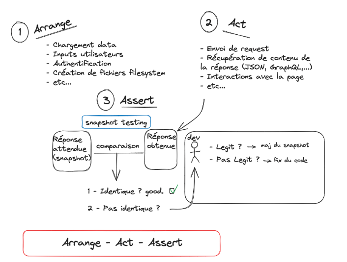
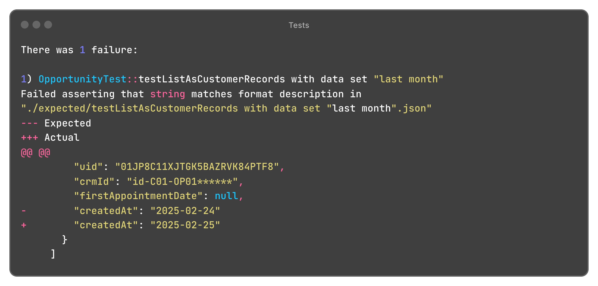

Tester du code dont la logique repose sur le temps peut compliquer l'écriture de scénarios de tests. Il s'agit de l'une
des erreurs les plus courantes pouvant mener à des tests fragiles et produisant des échecs hasardeux.  
Cette typologie de tests menant à des erreurs "aléatoires" est appelée <dfn>transient tests</dfn> car ceux-ci dépendent
d'un ou plusieurs facteurs parasites et non-maitrisés. Ici, l'élément parasite est le temps et l'horloge système.

## Contexte

Au travers d'un exemple concret au sein d'une application Symfony, nous allons voir comment écrire des tests insensibles
au temps avec PHPUnit et Foundry.

### Le projet

L'un de nos projets est connecté à un CRM externe et récupère une liste d'opportunités pour lesquelles les utilisateurs
de notre application pourront créer une ou plusieurs simulations. Ces opportunités sont ensuite exposées au sein de
différentes listes.
L'une d'entre elle consiste en un historique des "dossiers clients" des X derniers mois.

Notre application Symfony consiste en une API GraphQL, consommée par une application front en React. La liste de
dossiers client est alors disponible au travers de la requête GraphQL suivante :

```graphql
query ListOpportunities($limit: ListOpportunitiesQueryLimit) {
  listOpportunities(limit: $limit) {
    uid
    crmId # Identifiant sur le CRM
    firstAppointmentDate # Date de 1er RDV
    createdAt # Date de création de l'opportunité
  }
}
```

où `ListOpportunitiesQueryLimit` correspond à :

```graphql
input ListOpportunitiesQueryLimit {
  """
  Nombre de mois à remonter.
  Par défaut, les 6 derniers mois.
  """
  months: Int
}
```

Dans cette liste, nous espérons retrouver l'ensemble des opportunités pour lesquelles un critère ou une activité
significative a été réalisé dans les 6 derniers mois :
- l'opportunité a été créée dans les 6 derniers mois
- la date de premier rendez-vous est dans les 6 derniers mois
- une simulation a été créée dans les 6 derniers mois (_pour simplifier ici, nous omettrons ce cas de la démonstration_)

Notre _repository_ ressemble alors à ceci :

```php
interface OpportunityRepositoryInterface
{
    /**
     * List all opportunities for the customer records listing, i.e. opportunities that:
     * - are created within
     * - with an appointment date within
     * - or with simulations created during
     * the last X months.
     *
     * @param int $months The number of months to look back.
     *
     * @return Opportunity[]
     */
    public function findAllForRecords(int $months): array;
}
```

et son implémentation :

```php
class OpportunityRepository extends ServiceEntityRepository implements OpportunityRepositoryInterface
{
    public function __construct(ManagerRegistry $registry)
    {
        parent::__construct($registry, Opportunity::class);
    }

    public function findAllForRecords(int $months): array
    {
        $since = new \DateTimeImmutable("-$months months"));

        ($qb = $this->createQueryBuilder('opportunity'))
            // […]
            ->where($qb->expr()->orX(
                'opportunity.createdAt >= :since',
                'opportunity.firstAppointmentDate >= :since',
                // […]
            ))
            ->setParameter('since', $since)
        ;

        return $qb->getQuery()->getResult();
    }
}
```

### Les tests

Pour tester ce fonctionnel API, nous avons pour habitude d'opter pour des tests fonctionnels, en utilisant PHPUnit avec
un boilerplate personnalisé basé sur le `WebTestCase` de Symfony :

```php
class OpportunityTest extends GraphQLTestCase
{
    use ResetDatabase;

    /**
     * @dataProvider provide testListAsCustomerRecords data
     */
    public function testListAsCustomerRecords(?array $limit): void
    {
        // Chargement des données de test
        ListAsCustomerRecordsStory::load();
        
        // Execution de la requête GraphQL
        $this->executeGraphQL(compact('limit'), $this->getTestCaseInputContent(withDataSetName: false));
        
        // Assertions
        $this->assertValidGraphQLResponse();
        $this->assertJsonResponseMatchesExpectations();
    }

    public function provide testListAsCustomerRecords data(): iterable
    {
        yield 'use default month limit' => [null];
        yield 'last 6 months' => [['months' => 6]];
        yield 'last month' => [['months' => 1]];
    }
}
```

L'expression de nos scénarios de tests GraphQL est relativement concise et uniforme : nous chargeons des données de
test, exécutons une requête et vérifions la validité de la réponse. Enfin, nous faisons une assertion sur le
contenu de la réponse sur le principe du **« Snapshot testing »**, c'est-à-dire en comparant le contenu de la réponse
avec un fichier de référence, préalablement enregistré.  

Ici, un fichier par jeu retourné par le fournisseur de données (`dataProvider`):

- `./expected/testListAsCustomerRecords with data set "use default month limit".json`
- `./expected/testListAsCustomerRecords with data set "last 6 months".json`
- `./expected/testListAsCustomerRecords with data set "last month".json`

<figure style="max-width: 700px; margin-left: auto; margin-right: auto">
    
    <figcaption>
        <span class="figure__legend">
            Principe de nos tests fonctionnels avec snapshot testing <br />
            — <a href="https://x.com/Milidru/status/1698346706926993550">Illustration de Romane LEDRU, sur X</a>
        </span>
    </figcaption>
</figure>

!!! Note ""
    Nous ferons l'impasse sur le détail des méthodes `executeGraphQL`, `assertValidGraphQLResponse` et
    `assertJsonResponseMatchesExpectations` qui sont propres à notre `GraphQLTestCase`.
    Elles permettent de rédiger succinctement des tests en se basant sur quelques conventions.  
    Notamment, le fichier `./inputs/testListAsCustomerRecords.graphql` est automatiquement utilisé en tant que
    requête GraphQL à exécuter. Les fichiers de référence (nos _snapshots_, ou _expectations_) sont chargés depuis
    `./expected/<nom-du-test-case>.json` et comparés avec le contenu réel de la réponse au moment de l'exécution du test.

!!! success "Pour aller plus loin"
    Il existe aussi des bibliothèques clé en main pour gérer ce type de tests, telles que [spatie/phpunit-snapshot-assertions](https://github.com/spatie/phpunit-snapshot-assertions) ou [Pest PHP](https://pestphp.com/docs/snapshot-testing).

### Les données de test

Le plus gros du travail dans l'écriture de tests fonctionnels consiste à rédiger les données de test. Pour ce faire,
nous utilisons [Foundry](https://symfony.com/bundles/ZenstruckFoundryBundle/current/index.html) et des
[stories](https://symfony.com/bundles/ZenstruckFoundryBundle/current/index.html#stories) pour chaque ensemble de cas à
tester.

Voici un extrait de notre _story_ `ListAsCustomerRecordsStory` : 

```php
class ListAsCustomerRecordsStory extends Story
{
    /**
     * - an opportunity in last month
     * - an opportunity in last 2 months
     * - an opportunity in last 7 months, but with 1st appointment date within the last 2 months
     *
     * => All of these opportunities MUST appear in the last 6 months listing
     * => Only the 1st opportunity MUST appear in the last month listing
     */
    public function build(): void
    {
        OpportunityFactory::new()->create([
            'uid' => new Ulid('01JP8C11XJTGK5BAZRVK84PTF8'),
            'crmId' => 'id-C01-OP01******',
            'createdAt' => new \DateTimeImmutable('-1 month'),
            'firstAppointmentDate' => null,
        ]);
        
        OpportunityFactory::new()->create([
            'uid' => new Ulid('01JP8C0XPS4GWC47QZY4QDYEY0'),
            'crmId' => 'id-C01-OP02******',
            'createdAt' => new \DateTimeImmutable('-2 months'),
            'firstAppointmentDate' => null,
        ]);
        
        OpportunityFactory::new()->create([
            'uid' => new Ulid('01JP8CY28NBS5JXEA1FRX81WGK'),
            'crmId' => 'id-C01-OP03******',
            'createdAt' => new \DateTimeImmutable('-7 months'),
            'firstAppointmentDate' => new \DateTimeImmutable('-2 months'),
        ]);
    }
}
```

Foundry nous permet de décrire les données que nous souhaitons injecter dans notre base de façon relativement
expressive, et son système de [factories](https://symfony.com/bundles/ZenstruckFoundryBundle/current/index.html#factories)
nous permet de définir comment générer aléatoirement les données que nous ne souhaitons pas explicitement spécifier pour
ce test.

_Snapshot testing_ oblige, nous avons néanmoins besoins de données stables ou prédictibles.
C'est pourquoi l'ensemble des champs qui apparaitront dans notre query GraphQL doivent avoir une valeur fixe et connue.

!!! danger "Problématique"
    Les plus assidus d'entre vous auront déjà repéré le problème : les dates sont exprimées de façon relatives
    (`-1 month`, `-2 months`, etc.) et dépendent donc du moment de l'exécution des tests.

### Les snapshots

Voici le contenu du fichier `/expected/testListAsCustomerRecords with data set "last month".json`, lequel correspond au
scénario où nous ne souhaitons récupérer que les dossiers clients du dernier mois écoulé :

```json
{
  "data": {
    "listOpportunities": [
      {
        "uid": "01JP8C11XJTGK5BAZRVK84PTF8",
        "crmId": "id-C01-OP01******",
        "firstAppointmentDate": null,
        "createdAt": "2025-02-24"
      }
    ]
  }
}
```

Le contenu de ce fichier est généré sur demande, lors de l'exécution du test, à partir des données de la réponse
elle-même. Lors d'exécutions ultérieures, le contenu de la réponse sera comparé à ce fichier de référence pour vérifier
que celle-ci est toujours conforme à ce qui est attendu (_ou bien que ce qui diffère est légitime_).

Les éléments apparaissant dans la réponse nous aident à identifier la bonne présence ou non des opportunités attendues :
ici, l'opportunité `id-C01-OP01******` a bien été créée dans le dernier mois (à la rédaction de cet article, le 24 Mars
2025).

!!! danger "Problématique"
    Ici encore, nous avons un problème : la date de création de l'opportunité fait partie de la réponse alors que sa 
    génération est relative au moment de l'exécution du test (`-1 month`).

Lors de execution de ce test le lendemain, nous obtiendrons l'échec suivant :

<figure>
    
    <figcaption>
        <span class="figure__legend">
            Le test échoue car la date de création de l'opportunité dans les fixtures est relative à la date d'exécution du test, tandis que la date de création dans le snapshot est fixe.
        </span>
    </figcaption>
</figure>

[//]: # (Generated with: https://www.ray.so/)
[//]: # (Image text:)
[//]: # (There was 1 failure:)
[//]: # ( )
[//]: # (1&#41; OpportunityTest::testListAsCustomerRecords with data set "last month")
[//]: # (Failed asserting that string matches format description in "./expected/testListAsCustomerRecords with data set "last month".json")
[//]: # (--- Expected)
[//]: # (+++ Actual)
[//]: # (@@ @@)
[//]: # (         "uid": "01JP8C11XJTGK5BAZRVK84PTF8",)
[//]: # (         "crmId": "id-C01-OP01******",)
[//]: # (         "firstAppointmentDate": null,)
[//]: # (-        "createdAt": "2025-02-24")
[//]: # (+        "createdAt": "2025-02-25")
[//]: # (       })
[//]: # (     ])

[//]: # (Or as simple diff ?)
[//]: # (```diff)
[//]: # ({)
[//]: # (  "data": {)
[//]: # (    "listOpportunities": [)
[//]: # (      {)
[//]: # (        "uid": "01JP8C11XJTGK5BAZRVK84PTF8",)
[//]: # (        "crmId": "id-C01-OP01******",)
[//]: # (        "firstAppointmentDate": null,)
[//]: # (-       "createdAt": "2025-02-24")
[//]: # (+       "createdAt": "2025-02-25")
[//]: # (      })
[//]: # (    ])
[//]: # (  })
[//]: # (})
[//]: # (```)

Il ne serait pas possible d'exprimer ce test autrement, en indiquant une date absolue, car on ne pourrait alors pas
tester le fonctionnel _« Les dossiers clients du dernier mois »_  sans que ce test devienne rapidement caduque.

… _**à moins de modifier l'horloge de référence.**_


## Solutions

### Modifications dans le code

Moyennant quelques ajustements, il est aisé de résoudre cette situation, à commencer par modifier notre _repository_ 
pour calculer la date à partir de laquelle récupérer nos opportunités en utilisant une horloge de référence :

```diff
// […]
+use Symfony\Component\Clock\ClockAwareTrait;

class OpportunityRepository extends ServiceEntityRepository implements OpportunityRepositoryInterface
{
+    use ClockAwareTrait;

    // […]

    public function findAllForRecords(int $months): array
    {
-        $since = new \DateTimeImmutable("-$months months"));
+        $since = $this->now()->modify("-$months months");

        // […]
    }
}
```

Au lieu d'utiliser un objet `\DateTimeImmutable`, basé sur l'horloge système, le trait [
`ClockAwareTrait`](https://github.com/symfony/symfony/blob/7.2/src/Symfony/Component/Clock/ClockAwareTrait.php) nous
permet d'accéder à un service qui implémente `ClockInterface`. Celui-ci nous permet de récupérer la date et heure
actuelle selon une horloge que nous pouvons contrôler arbitrairement.

### Modifications dans les tests

L'horloge par défaut ([`NativeClock`](https://github.com/symfony/symfony/blob/7.2/src/Symfony/Component/Clock/NativeClock.php)) 
se base sur celle du système et est identique à appeler `new \DateTimeImmutable()`.  
Mais il nous est possible de la modifier au besoin. À tout hasard, dans notre test :

```diff
+use Symfony\Component\Clock\Test\ClockSensitiveTrait;

// […]

class OpportunityTest extends GraphQLTestCase
{
+    use ClockSensitiveTrait;
    use ResetDatabase;

    public function testListAsCustomerRecords(?array $limit): void
    {
+        // Choix d'une date de référence arbitraire, ici le 1er Septembre 2024:
+        static::mockTime('2024-09-01 00:00:00');
    
        // Chargement des données de test
        ListAsCustomerRecordsStory::load();
        
        // Execution de la requête GraphQL
        $this->executeGraphQL(compact('limit'), $this->getTestCaseInputContent(withDataSetName: false));
        
        // Assertions
        $this->assertValidGraphQLResponse();
        $this->assertJsonResponseMatchesExpectations();
    }

    // […]
}
```

La méthode `ClockSensitiveTrait::mockTime()` nous permet de fixer l'horloge de référence à une date et heure arbitraire
pour toute l'exécution du test.

!!! Tip ""
    À la fin du test, le trait `ClockSensitiveTrait` s'occupe de restaurer l'horloge à son état initial.

Enfin, nous devons adapter légèrement nos données de test pour utiliser cette même horloge dans notre _story_ :

```diff
// […]
+use Symfony\Component\Clock\Clock;

class ListAsCustomerRecordsStory extends Story
{
    public function build(): void
    {   
+        $clock = Clock::get(); // Récupération de l'horloge de référence
        
        OpportunityFactory::new()->create([
            'uid' => new Ulid('01JP8C11XJTGK5BAZRVK84PTF8'),
            'crmId' => 'id-C01-OP01******',
-            'createdAt' => new \DateTimeImmutable('-1 month'),
+            'createdAt' => $clock->now()->modify('-1 month'),
            'firstAppointmentDate' => null,
        ]);
        
        OpportunityFactory::new()->create([
            'uid' => new Ulid('01JP8C0XPS4GWC47QZY4QDYEY0'),
            'crmId' => 'id-C01-OP02******',
-            'createdAt' => new \DateTimeImmutable('-2 months'),
+            'createdAt' => $clock->now()->modify('-2 months'),
            'firstAppointmentDate' => null,
        ]);
        
        OpportunityFactory::new()->create([
            'uid' => new Ulid('01JP8CY28NBS5JXEA1FRX81WGK'),
            'crmId' => 'id-C01-OP03******',
-            'createdAt' => new \DateTimeImmutable('-7 months'),
-            'firstAppointmentDate' => new \DateTimeImmutable('-2 months'),
+            'createdAt' => $clock->now()->modify('-7 months'),
+            'firstAppointmentDate' => $clock->now()->modify('-2 months'),
        ]);
    }
}
```

Et voilà ! En seulement quelques lignes peu structurantes, nous avons résolu notre problème : la génération de nos
données de tests reste expressive et se base sur une horloge de référence que nous pouvons contrôler arbitrairement. 
Cette même horloge est partagée par notre _repository_ et notre test fournit une date de référence arbitraire pour
garantir leur stabilité dans le temps.  

Les dates qui apparaitront dans nos _snapshots_ sont alors entièrement prédictibles et stables, quel que soit le moment
d'exécution de nos tests, ou la configuration de l'horloge système : 

```json
{
  "data": {
    "listOpportunities": [
      {
        "uid": "01JP8C11XJTGK5BAZRVK84PTF8",
        "crmId": "id-C01-OP01******",
        "firstAppointmentDate": null,
        "createdAt": "2024-08-01"
      }
    ]
  }
}
```

## Historique

Cette solution n'est pas nouvelle, et historiquement, des bibliothèques de manipulation de dates telles que
[Carbon](https://github.com/CarbonPHP/carbon) permettent de surcharger l'horloge de référence : 

```php
Carbon::setTestNow(Carbon::create(2024, 09, 01, 00, 00);
```

Seulement, cela nous oblige à passer par des objets différents des objets natifs de PHP (bien qu'il les étende) et
demande potentiellement davantage d'adaptation dans notre code si l'on souhaite bénéficier des fonctionnalités qui lui
sont propres.

Symfony quant à lui propose [depuis la version 2.8](https://symfony.com/blog/new-in-symfony-2-8-clock-mocking-and-time-sensitive-tests)
une classe [`ClockMock`](https://symfony.com/doc/current/components/phpunit_bridge.html#clock-mocking) au sein de son
[bridge PHPUnit](https://symfony.com/doc/current/components/phpunit_bridge.html) modifiant le comportement de plusieurs
fonctions natives de PHP (`time`, `microtime`, `sleep`, `usleep`, …), afin de résoudre d'autres problématiques de 
_transient tests_ basés sur le temps.  
Par exemple, un appel à `sleep(10)` fera avancer l'horloge d'exactement 10 secondes, indépendamment de la charge du
serveur, et en bonus, sans bloquer réellement votre suite de tests pendant ces 10 secondes (_le composant Clock fournit
cette même fonctionnalité avec la classe [MockClock](https://github.com/symfony/symfony/blob/7.2/src/Symfony/Component/Clock/MockClock.php)_).

[En 2021](https://github.com/php-fig/fig-standards/pull/1224), le groupe [PHP-FIG](https://www.php-fig.org/), 
qui vise à établir des standards d'interopérabilité au sein des projets PHP, a proposé la 
[PSR-20 Clock](https://www.php-fig.org/psr/psr-20/) pour 
[analyser les pratiques existantes, leurs avantages et inconvénients](https://www.php-fig.org/psr/psr-20/meta/#2-why-bother),
et proposer une interface qui puisse répondre à ces deux problématiques :
- Fournir une méthode simple et "mockable" pour obtenir une date et heure de référence 
- Favoriser l'interopérabilité entre les bibliothèques qui manipuleraient cette horloge

[Symfony 6.2](https://symfony.com/blog/new-in-symfony-6-2-clock-component) introduit alors son composant 
[`Clock`](https://symfony.com/doc/current/components/clock.html), conçu autour de cette interface.

D'autres implémentations `psr/clock-implementation`, dont celles qui ont fait office de références pour les auteurs de
la PSR-20, sont disponibles sur Packagist: https://packagist.org/providers/psr/clock-implementation

## Liens & références

- [La PSR-20 Clock](https://www.php-fig.org/psr/psr-20/) et sa [méta-analyse de l'écosystème PHP sur le sujet](https://www.php-fig.org/psr/psr-20/meta/)
- [La documentation du composant Clock de Symfony](https://symfony.com/doc/current/components/clock.html)
- [New in Symfony 2.8 - Clock mocking and time sensitive tests](https://symfony.com/blog/new-in-symfony-2-8-clock-mocking-and-time-sensitive-tests)
- [New in Symfony 6.2 - Clock Component](https://symfony.com/blog/new-in-symfony-6-2-clock-component)
- [« Writing Time-Sensitive Tests »](https://symfony.com/doc/current/components/clock.html#writing-time-sensitive-tests) dans la doc Symfony
- [La documentation du ClockMock du bridge PHPUnit de Symfony](https://symfony.com/doc/current/components/phpunit_bridge.html#clock-mocking)
- [Carbon PHP](https://github.com/CarbonPHP/carbon)
