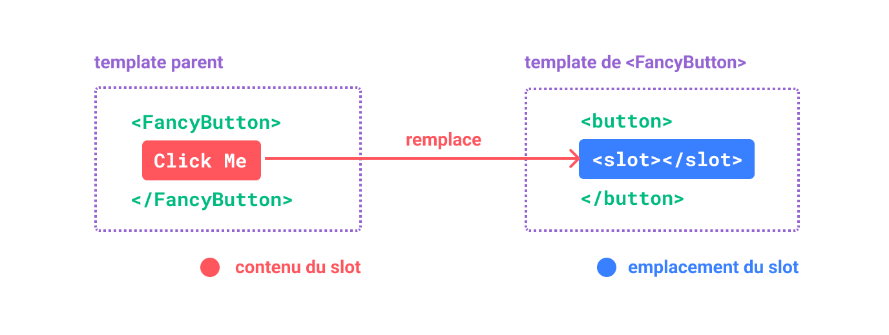

## Introduction

En tant que développeur React, vous avez probablement déjà été confrontés à la création de composants génériques.
Ces composants sont souvent utilisés pour mutualiser des comportements communs à plusieurs endroits de votre application 
et nécessitent d'être suffisamment personnalisables pour pouvoir s'adapter à la situation.

### Factoriser le markup, personnaliser le contenu

Par exemple, un composant `Modal` peut être constitué de plusieurs sous-parties dont vous souhaiteriez uniquement
personnaliser le contenu :


Et dont le rendu HTML pourrait être le suivant :

```html
<div class="modal">
    <div class="modal-header">
        <!-- Title -->
        <h2>Objectifs</h2>
    </div>

    <div class="modal-content">
        <!-- Content -->
        <p>Contenu de ma modale</p>
        <a href="…">En découvrir plus…</a>
    </div>

    <div class="modal-footer">
        <!-- Footer -->
        <button onClick="…">Fermer</button>
    </div>
</div>
```

Chacune des sous-parties `Title`, `Content` et `Footer` de ce composant possède autour de son contenu un markup HTML
qui lui est propre et qu'il convient de ne pas avoir à répéter à chaque utilisation du composant `<Modal>` :

```jsx
<Modal>
  {/* Injection d'un simple texte dans le titre de la modale */}
  <Modal.Title>Objectifs</Modal.Title>

  {/* Contenu JSX */}
  <Modal.Content>
    <p>Contenu de ma modale</p>
    <a href="…">En découvrir plus…</a>
  </Modal.Content>

  {/*
    Fonction de rendu utilisée pour le contenu du footer,
    se voyant injecté la fonction de fermeture de la modale
  */}
  <Modal.Footer>{
    ({ close }) => <button onClick={close}>Fermer</button>
  }</Modal.Footer>
</Modal>
```

De cette façon, il n'y a plus qu'à fournir le contenu dynamique de ces sous-parties, le reste du markup étant abstrait. 

### Abstraire les comportements

Voici un composant `DropMenu` :


Dont le code JSX, à l'utilisation serait le suivant :

```jsx
 <DropMenu>
  {/* Bouton déclenchant l'apparition du menu dropdow */}
  <DropMenu.Trigger>
    <button type="button">Bonjour John Doe</button>
  </DropMenu.Trigger>

  {/* Éléments du menu à afficher */}
  <DropMenu.Items>
    <DropMenu.Item>
      <Link to={route(Profile)}>Mon profil</Link>
    </DropMenu.Item>
    <DropMenu.Item>
      <Link to={route(Projects)}>Mes projets</Link>
    </DropMenu.Item>
    <DropMenu.Item>
      <Link to={route(Logout)}>Déconnexion</Link>
    </DropMenu.Item>
  </DropMenu.Items>
</DropMenu>
```

Ici, l'élément `<DropMenu.Trigger>` est utilisé pour définir un comportement sur le `<button>` qu'il encapsule
afin de déclencher l'affichage des sous-éléments du `<DropMenu.Items>`.  
Dans son fonctionnement interne, le composant `<DropMenu>` viendra décorer le composant encapsulé pour lui ajouter
automatiquement la propriété `onClick` avec la logique correspondante.

Les éléments `Items` & `Item` s'assurent quant à eux de fournir le bon markup HTML pour la liste des éléments du menu,
sans avoir à répéter ce markup à chaque utilisation du composant `DropMenu`.

Ces éléments constitutifs d'un composant réutilisable, définissant des emplacements spécifiquement identifiables -
permettant de décorer, mutualiser et personnaliser leur contenu - sont communément appelés des **slots**.

## À propos des slots

Le terme **slot** est bien connu des développeurs utilisant
[Vue.js](https://fr.vuejs.org/guide/components/slots.html), lequel formalise ce concept en exposant
explicitement un élément `<slot>` pour définir un emplacement du composant dans lequel le contenu fourni sera injecté.



Il est aussi possible de [nommer ces slots](https://fr.vuejs.org/guide/components/slots.html#named-slots) afin de
pouvoir en utiliser plusieurs au sein d'un même composant :


Nous aboutissons alors à un markup similaire à notre exemple de modale ci-dessus :

```html
<Modal>
  <template #title>Objectifs</template>
    
  <template #content>
    <p>Contenu de ma modale</p>
    <a href="…">En découvrir plus…</a>
  </template>
  
  <template #footer>
    <!-- … -->
  </template>
</Modal>
```

Le [concept](https://developer.mozilla.org/fr/docs/Web/API/Web_components/Using_templates_and_slots) est disponible
à l'identique dans l'API des [Web Components](https://developer.mozilla.org/fr/docs/Web/API/Web_components).

## Les slots dans React

React n'évoque à proprement parler jamais la notion de slots.   
Cependant, il est bel et bien possible de se baser sur cette notion lors de la conception de vos composants. 
_Vous l'avez probablement déjà fait sans le savoir._

### Slot par défaut

Le cas le plus simple est celui d'un composant qui ne possède qu'un seul slot, celui par défaut, connu comme la
propriété [`children`](https://react.dev/learn/passing-props-to-a-component#passing-jsx-as-children) disponible dans
tout composant React :

```jsx
// App.jsx
<Modal>
  {/* Slot par défaut, disponible en tant que propriété `children` du composant Modal */}
  <p>Contenu de ma modale</p>
  <a href="…">En découvrir plus…</a>
</Modal>
```

```jsx
// Modal.jsx
function Modal({ children }) {
  return <div className="modal">
    <div className="modal-content">
      {children} {/* <-- Contenu injecté du slot par défaut */}
    </div>
  </div>;
}
```

**Inconvénient** : le contenu JSX passé à l'intérieur de `<Modal>` n'est disponible que sous une seule et même
propriété `children`, limitant virtuellement le nombre de slots disponibles à un seul. Il existe cependant une façon
naturelle de contourner ce problème. 

### Slots multiples via props

Il est possible de définir plusieurs slots en utilisant des `props` dédiées :

```jsx
// App.jsx
<Modal
  title="Objectifs"
  content={<>
    <p>Contenu de ma modale</p>
    <a href="…">En découvrir plus…</a>
  </>}
  footer={
    ({ close }) => <button onClick={close}>Fermer</button>
  }
/>
```

```jsx
// Modal.jsx
function Modal({ content, title, footer }) {
  const close = () => {/* … */};
  
  return <div className="modal">
    <div className="modal-header">
      <h2>{title}</h2>
    </div>
    
    <div className="modal-content">
      {content}
    </div>
    
    <div className="modal-footer">
      {footer({ close })}
    </div>
  </div>;
}
```

**Inconvénient** : à mesure que vos composants, le nombre de slots, ou les contenus injectés augmentent, la lisibilité
est compromise. Par exemple, avec un composant plus riche :

```jsx
// App.jsx
<Modal
  title={<span>Un contenu <strong>plus riche</strong></span>}
  icon={<Icon name="info" />}
  closeIcon={<Icon name="close" />}
  content={<>
    <p>Contenu de ma modale</p>
    
    <ul>
      <li>Un</li>
      <li>Deux</li>
      <li>Trois</li>
    </ul>
    
    <a href="…">En découvrir plus…</a>
  </>}
  footer={({ close }) => <>
    <button onClick={{/* … */}}>Annuler</button>
    <button onClick={close}>Accepter</button>
  </>}
/>
```

L'intérêt du [JSX](https://fr.reactjs.org/docs/introducing-jsx.html) étant d'exposer une syntaxe proche du HTML, il est
moins naturel à la lecture de retrouver ces contenus en tant que propriétés plutôt que nœuds enfants d'un composant.

Il est bien sûr possible de faire un mix des deux approches, en utilisant `children` pour définir l'un des slots :

```jsx
// App.jsx
<Modal
 title="Objectifs" 
 footer={
   ({ close }) => <button onClick={close}>Fermer</button>
 }
>
  <p>Contenu de ma modale</p>
  <a href="…">En découvrir plus…</a>
</Modal>
```

bien que ce choix puisse sembler arbitraire et ne résolve pas notre problématique lors de la multiplication des slots
acceptant du JSX.

### Slots multiple via JSX

Il est possible d'obtenir une stucture plus naturelle en utilisant le markup JSX pour définir les slots, des
sous-composants React pour chaque et en utilisant [les APIs React](https://fr.reactjs.org/docs/react-api.html#reactchildren)
visant à manipuler la propriété `children`.

Afin d'aboutir à une telle syntaxe :

```jsx
// App.jsx
<Modal>
  <Modal.Title>Objectifs</Modal.Title>

  <Modal.Content>
    <p>Contenu de ma modale</p>
    <a href="…">En découvrir plus…</a>
  </Modal.Content>

  <Modal.Footer>{
    ({ close }) => <button onClick={close}>Fermer</button>
  }</Modal.Footer>
</Modal>
```

Commençons par créer nos sous-composants dans notre fichier `Modal.jsx`:

```jsx
// Chacun de nos slots est un sous-composant React dédié, 
// permettant de l'identifier par son type :

function Title({ children }) {
  return <h2>{children}</h2>;
}

function Content({ children }) {
  return <div className="modal-content">
    {children}
  </div>;
}

function Footer({ children, close }) {
  return <div className="modal-footer">
    {/* 
      Dans le cas où le contenu de <Modal.Footer> est une fonction,
      nous l'invoquons en lui transmettant la fonction de fermeture de la modale
    */}
    {typeof children === 'function' ? children({ close }) : children}
  </div>;
}
```

Par la suite, nous allons avoir besoin d'une fonction pour identifier chacun de nos sous-composants parmi les enfants de
notre `<Modal>` :

```jsx
/**
 * Fonction utilitaire permettant de trouver un noeud enfant correspondant à un type donné
 */
function findSlotOfType(children, slotType) {
  return Children.toArray(children).find((child) => child.type === slotType);
}
```

En la matière, [`Children.toArray`](https://fr.reactjs.org/docs/react-api.html#reactchildrentoarray) permet
d'obtenir un tableau linéarisé du contenu passé à notre `<Modal>`.  
Nous pouvons alors rechercher, isoler et manipuler nos slots parmi ces nœuds en les identifiant par leur type.

!!! info ""
    Cette implémentation se repose
    sur [la façon de fonctionner de JSX](https://sandroroth.com/blog/react-slots#slots-by-type), qui expose une
    propriété `type` sur chacun des éléments qu'il crée.

Dès lors, nous pouvons agencer et récupérer le contenu de chacun de nos slots au sein de notre composant `Modal` :

```jsx
import React, { Children, cloneElement } from 'react';

function Modal({ children }) {
  const close = () => {/* … */};

  // Récupération de chaque slot : 
  const TitleComponent = findSlotOfType(children, Title);
  const ContentComponent = findSlotOfType(children, Content);
  const FooterComponent = findSlotOfType(children, Footer);

  // Clone de l'élement FooterComponent pour lui passer la fonction close
  const FooterEl = FooterComponent ? cloneElement(FooterComponent, { close }) : undefined;

  return <div className="modal">
    {TitleComponent}
    {ContentComponent}
    {FooterEl}
  </div>;
}
```

Enfin, nous exportons notre composant modal et chacun de ses sous-composants en tant que propriétés de ce dernier,
créant ainsi un **espace de nom** commun à tous ces éléments (a.k.a [_namespaced components_](https://react-typescript-cheatsheet.netlify.app/docs/advanced/misc_concerns#namespaced-components)) :

```jsx
// https://react-typescript-cheatsheet.netlify.app/docs/advanced/misc_concerns#namespaced-components
export default Object.assign(Modal, { Title, Content, Footer });
```

➜ _Retrouvez le code complet pour cet exemple sur [ce gist](https://gist.github.com/ogizanagi/f841c8f002b522426c74709eeb8347ba)._

**Inconvénient** : Il n'est -
[à priori](https://react-typescript-cheatsheet.netlify.app/docs/advanced/patterns_by_usecase/#what-you-cannot-do) -
pas possible de rendre un slot obligatoire de façon à ce que l'analyse statique remonte une erreur si celui-ci n'est pas
fourni, y compris avec TypeScript.

Il est par contre possible de lever une exception à l'exécution si le slot n'est pas trouvé :

```jsx
function Modal({ children }) {
  // …
  const ContentComponent = findSlotOfType(children, Content);
  
  if (!ContentComponent) {
    throw new Error('You MUST provide a <Modal.Content> component as a child of <Modal>.');
  }
  // …
}
```

### Bonus: exemple de DropMenu

Vous pouvez consulter sur [ce gist](https://gist.github.com/ogizanagi/db03004d72b680ab03998308f3c18823) 
l'implémentation d'un composant `<DropMenu>` utilisant cette approche, TypeScript et 
[MUI Base](https://mui.com/base/getting-started/overview/), relatif à l'exemple de notre [introduction](#abstraire-les-comportements).

## Conclusion

React ne suggère pas de manière explicite la notion de slots, mais il est possible de s'inspirer de ce concept en
exploitant les propriétés de JSX et `children` afin de simuler l'utilisation de slots multiples avec une syntaxe proche
du HTML, semblable à ce qui peut se faire avec d'autres frameworks.

Cette approche n'est cependant peut-être pas à généraliser à tous les composants que vous écrirez ; la plupart des
composants pouvant très bien s'accommoder de l'utilisation de simples `props` pour ce besoin.

## Aller plus loin & sources

Vous pouvez poursuivre la réflexion et découvrir d'autres approches au sein de cet excellent article de Sandro Roth :
[« Building Component Slots in React »](https://sandroroth.com/blog/react-slots)

ou consulter ces ressources additionnelles :

- [Les slots dans Vue.js](https://fr.vuejs.org/guide/components/slots.html)
- [Les slots dans les Web Components](https://developer.mozilla.org/fr/docs/Web/API/Web_components/Using_templates_and_slots)
- [React Slot RFC](https://github.com/reactjs/rfcs/pull/223)
