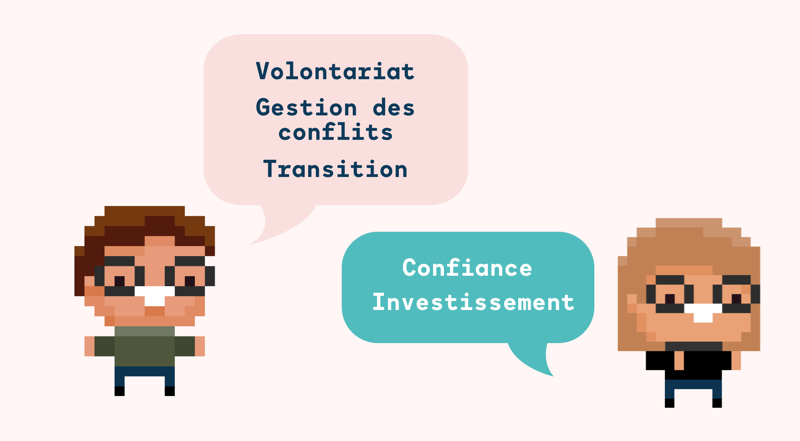

!!! note "Cette article fait partie d'une série de 5 épisodes"
    Pour rattraper ou relire notre premier épisode, c’est par [ici](./accompagnement-alternants-episode-1.md) 
    (sinon vous risquez d’être perdus 🙃).

Vous l’aurez compris, cette série d'articles a pour objectif de partager notre vision et notre démarche d’accompagnement
des alternant.es, dans le but d'inspirer ou d’apporter des idées. Conscients que cette approche en est encore à ses
débuts, nous comptons l'affiner au fil des années grâce aux retours de nos alternant.es, qui nous permettront de
développer un processus encore plus adapté à leurs attentes.

Cependant, au cours de cette année de mise en place, nous avons identifié des **points clés** ainsi que des éléments de
**vigilance** qui nous paraissent importants de garder à l’esprit.👇

- L’alternance se base sur le **volontariat** des encadrants. Si l’on souhaite mettre en place un accompagnement
  qualitatif et durable, il est important que les encadrants soient eux-mêmes volontaires pour s’y investir pleinement.
- Accompagner la montée en compétences d’un·e alternant·e prend du temps. Il faut être conscient que cela **impactera
  l’équipe** (le temps dont aura besoin l’encadrant pour former le/la tutoré·e sera un temps qu’il ne passera pas sur de
  la production). L’engagement temporel que cela demande n’est pas un problème, il en devient un si l’équipe n’y est pas
  préparée.
- Instaurer la **confiance** entre le tuteur et le/la tutoré·e est un point central, si on souhaite donner l’espace
  nécessaire à ce dernier pour qu’il/elle puisse s’exprimer librement et faire remonter tout type d’élément. De part
  notre expérience, nous n’avons pas rencontré de difficultés à ce sujet, mais nous veillons à le garder en tête pour
  nos prochaines recrues.

<figure>
    
    <figcaption>
        Point clés et éléments de vigilance
    </figcaption>
</figure>

Bien que nous n’ayons pas vécu ces limites potentielles, nous avons pu soulever deux autres points notables :

- La **gestion du conflit**. Nous avons eu la chance de travailler avec des alternant·tes pour lesquel·es le suivi s’est
  très bien passé, cependant, il peut arriver que la gestion de l’alternance soit plus difficile pour un grand nombre de
  raisons (une mauvaise intégration, des difficultés dans le quotidien, une incompatibilité de caractère etc.).
  Actuellement, nous n’avons pas de bonnes conduites à partager, n'ayant pas vécu cette situation au sein de l’agence,
  mais nous pouvons tout de même souligner l’importance de **désamorcer** rapidement la situation, de faire remonter les
  doutes, les difficultés afin qu’une solution soit rapidement mise en place (changement de tuteur.ice, formation du
  maitre d’apprentissage, mise en place de rituels…).
- Le **changement de statut** dans l’entreprise. Imaginons, votre super alternant·te arrive à la fin de sa formation et
  vous souhaitez tous deux continuer l’aventure. Un changement de statut devra s’opérer, passant d’alternant·e à
  salarié·e permanent·e au sein de l’entreprise. Nous pensons qu’il est important de veiller à bien organiser cette
  **transition**, de laisser votre tutoré·e évoluer vers ce nouveau poste. Un accompagnement sur les premiers mois
  permettra de suivre cette évolution, de s’assurer que tout se passe bien pour le/la salarié·e, qu’il/elle prend ses
  marques avec ce nouveau statut. Ensuite, ce sera au pôle RH de prendre le relais.

Un accompagnement professionnel, qu’il soit auprès d’un·e alternant·e ou d’un·e salarié·e permanent·e est avant tout un
accompagnement **humain**. La complexité des relations humaines étant, il nous paraît difficile d’élaborer une ligne de
conduite précise. Ce que l’on peut retenir du suivi de cette année, c’est avant tout **l’écoute**, la prise en
considération des **besoins** et la volonté de faire tout ce qui est en notre pouvoir afin de répondre le plus justement
possible au besoin de nos alternant.es.

On a beaucoup parlé, mais si on laissait un peu la place aux premiers concernés ?

Dans le prochain et dernier épisode de cette série d’article (oui déjà 🥲), vous découvrirez l’interview de quelques
alternant·es qui partagent leur avis sur la méthodologie de suivi et sur leur expérience générale au sein de l’agence.  

