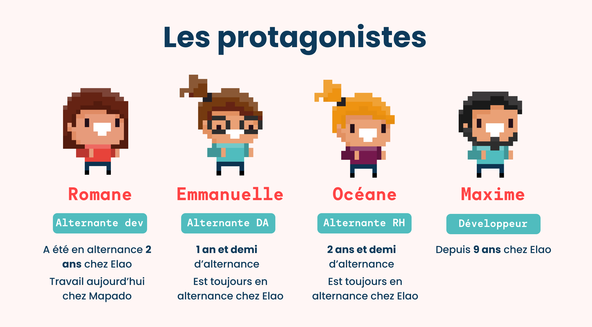

!!! note
    Pour rattraper ou relire notre premier épisode, c’est par [ici](./accompagnement-alternants-episode-1.md) (sinon
    vous risquez d’être perdus 🙃).

Cette série d'épisodes sur l’accompagnement de nos alternants touche à sa fin.🥲  
Pour clôre ce sujet, nous avons décidé de donner la parole aux premier·ère·s concerné·e·s : les **alternantes** et l’un
de nos **tuteurs tech** chez Elao.  
C’était pour nous l’occasion de **faire le point** sur l’accompagnement mis en place, de dresser un **bilan** sur le
vécu de nos alternantes et de **réceptionner** leurs feedbacks afin de continuer à **améliorer** nos process.

Êtes-vous prêt·e·s à partir à la rencontre de
Romane, [Emmanuelle](../../../member/eflahaut.yaml), [Océane](../../../member/ogandillon.yaml)
et [Maxime](../../../member/msteinhausser.yaml) ? C’est parti !

Avant tout, voici une petite fiche récapitulative de qui sont nos protagonistes 👇 

<figure>
    
    <figcaption>
        Présentation des protagonistes interviewés
    </figcaption>
</figure>

## Une expérience globale de l'alternance en demi teinte : le rôle central de l'entreprise 

Parmi nos alternantes, pour deux d’entre elles leurs expériences avant Elao leur ont laissé un goût parfois amer. Leur
**rôle** en tant qu’alternante et les **efforts** fournis n’étaient pas reconnus. De plus, la formation et
l’accompagnement faisaient parfois défaut, ce qui leur a donné un sentiment de **manque de valorisation**. Pour
Emmanuelle, qui a vécu 2 alternances avant de rejoindre Elao, l'entreprise joue un rôle crucial dans la **réussite** et
**l’épanouissement** de l’alternant·e.

> L’entreprise fait tout dans une alternance. Dans le sens où une alternance ça peut très mal se passer comme très
> bien, et l’état d’esprit de l’entreprise vis-à-vis de l’alternance, du travail et de l’équilibre entre école et travail,
> fait beaucoup.
> <cite>— Emmanuelle</cite>

Pour Romane, qui n’avait pas vécu d’alternance avant son arrivée chez Elao, **l’investissement de l’entreprise** a
également été souligné.

> Ça fait plaisir de voir une entreprise qui s'investit dans l’accompagnement, parce que ce n'est apparemment pas
> courant d'après les témoignages que j'avais des autres alternants de ma promotion.
> <cite>— Romane</cite>

On comprend donc, qu’en tant qu’entreprise, le défi est de taille et pèse fortement dans la **réussite** de
l’expérience. L’entreprise qui souhaite intégrer une personne en alternance doit bien garder en tête le but d’une
**formation** de ce type : l’alternant·e a besoin d’une véritable formation pour pouvoir apprendre son métier et être
capable de le maîtriser. Ce n’est pas un·e salarié·e qui effectuera quotidiennement les tâches qu’on souhaite lui
donner. Il/elle aura besoin d’un **suivi**, de **temps dédié** pour apprendre, **pratiquer** afin de gagner petit à
petit en autonomie. Le tout, **entouré** de personnes **compétentes** et capables de lui **dédier du temps**.

## L'alternance chez Elao : un onboarding nécessaire, un suivi humain important, une formation tech appréciée et des limites pour les métiers transverses

Globalement, **l’onboarding** a été un moment important et bien structuré, ce qui a permis aux alternantes de se sentir
à l’aise rapidement et d’avoir le nécessaire pour commencer leur apprentissage. 

> Je suis arrivée en même temps que deux autres personnes, embauchées comme des employés classiques. J'ai donc pu 
> bénéficier du même onboarding qu'elles, selon un processus déjà bien rodé de la part d’Elao.
> <cite>— Romane</cite>

> J’ai eu un très bon accueil, j’ai été bien intégrée même si c’était un monde tech que je ne connaissais pas et que
> j’avais tendance à appréhender. J’ai eu un très bon feeling avec [Guewen](../../../member/gfaivre.yaml) lors de 
> l’entretien, c’était très détendu. Au début ça s’est plutôt bien passé, le temps de m’intégrer aux process, etc.
> <cite>— Océane</cite>

Du côté de Romane, notre seule alternante tech, le **fonctionnement de la formation** proposée a été apprécié notamment
via les sessions de **pair programming** qu’elle a eu l’occasion de réaliser avec son
tuteur [Maxime](../../../member/msteinhausser.yaml).

> Je me souviens d'une semaine de peer programming que j'ai faite avec Maxime il y a deux ans à peu près. J'ai été
> accompagnée pas à pas sur la tâche sur laquelle j'allais monter parce qu'elle était trop compliquée pour que je la
> fasse toute seule. Et c'est là où j'ai pris le plus de niveau. J'avais littéralement un développeur qui 
> m'accompagnait pas à pas dans la tâche sur laquelle j'étais en train de monter.
> <cite>— Romane</cite>

Bien que le but d’une alternance soit la montée en compétence dans le cœur de métier de la tutorée, l’aspect **humain**
tient une part importante au sein d’Elao.

> Le fait de vous former à l’accompagnement des alternants et que ce ne soit pas seulement sur le suivi des tâches mais
> également sur un accompagnement de l'alternant en tant qu’être humain, c'est un très bon point et c’est quelque chose
> que je n’ai jamais eu en alternance.
> <cite>— Emmanuelle</cite>

> Clairement, j'ai été super bien accompagnée surtout sur le plan du suivi, pas que du côté du travail, mais aussi du
> côté humain.
> <cite>— Romane</cite>

On vous rassure, tout n’est pas tout beau tout rose chez Elao 😉, et comme vous avez pu le comprendre à travers les
autres épisodes de cette série d’articles, l’agence n’a pas toujours eu les billes pour établir un suivi efficace
notamment sur les métiers transverses à celui de développeur.  
Pour Océane qui évolue sur la partie RH et administrative, le terme “suivi des alternants” rimait avec néant à ses 
débuts en 2022. N’ayant pas en interne l’ensemble des compétences pour l'accompagner dans son cœur de métier, cette 
dernière a eu quelques difficultés à développer l’étendue de son poste et à trouver de la **légitimité**.
Il a fallu l’arrivée d’Elodie, une RH externe, pour lui donner **confiance**, l’aider à augmenter son **spectre de
compétences** et obtenir “une validation” par un **pair**.

> J’ai pris confiance, car Elodie m’a rassuré sur plein de choses que je faisais bien et que j’étais en capacité de
> faire. Elle a eu cet œil externe comme l’a [Murielle](../../../member/mzelboch.yaml) aujourd’hui et m’a permis de 
> légitimer le poste. Ça m’a également permis de me montrer l'étendue des chantiers que je pouvais mener, ce qu’il y 
> avait à faire.
> <cite>— Océane</cite>

À l’instar d’Océane, Emmanuelle, notre alternante en DA, est également la seule à avoir ce rôle au sein de l’agence.
Bien que ce fût un peu déroutant pour elle au départ et que cela lui demande un peu plus de temps pour se former, elle
souligne le fait qu’elle se sent toujours **entourée** et **aidée** si elle en a le besoin.

> Même s'il n'y a personne qui fait ce que je fais pour pouvoir m'accompagner sur mes tâches (comme s'il y avait un DA
> senior avec moi), ça n'empêche qu'il y a un suivi. Vous faites tout ce que vous pouvez pour pouvoir m'aider. Et quand je
> demande de l'aide ou de la participation, il y en a toujours. Certes ça signifie qu'il y a des trucs où je dois tâtonner
> un peu et que du coup, ça me prend plus de temps.
> <cite>— Emmanuelle</cite>

En résumé, chez Elao, nous avons réussi à accompagner nos alternantes sur les métiers tech mais également d’un point de
vue humain en s’assurant de leur **bien-être** et du bon **équilibre entreprise/école**.  
Bien qu’experts dans les métiers tech, nous n’avons pas toujours un collaborateur spécialisé dans une compétence
transverse. Pour pallier ça, et apporter une formation dès plus satisfaisante à nos alternantes, nous sommes à même de
constituer des pôles où chacun peut apporter son expertise et établir un accompagnement sur les fonctions qu’il
maîtrise.

## La place de l'autonomie dans une alternance chez Elao 

À travers les différents échanges réalisés avec les alternantes et Maxime, nous avons constaté que **l’autonomie** avait
une place importante pour le bon fonctionnement d’une alternance chez Elao.  
En effet, au sein de l’agence, la **confiance** est instaurée très rapidement (c’est une de nos valeurs fondamentales)
et nous aimons laisser les collaborateur·rice·s évoluer à leur rythme en fonction de leurs capacités. Cet aspect-là peut
parfois être déroutant, notamment pour des alternant·e·s qui peuvent avoir besoin d’un cadre plus important.

> Elao repose beaucoup sur la confiance. Le fait de laisser le champ libre, complètement, à la fois, c'est bien et d’un
> autre côté ça ne l’est pas parce que quand tu viens d'arriver dans une entreprise, tu as quand même besoin de quelques
> directives, au moins pour commencer, pour t’habituer, etc.
> <cite>— Emmanuelle</cite>

Romane s'accorde également sur l’autonomie demandée chez Elao, bien que pour elle, ce soit une qualité à détenir de base
dans le métier de développeur.

> Le développement, c'est un métier qui demande à ce qu'on fasse constamment nos propres recherches. Peut-être que l'IA
> facilitera l'accès à l'informatique pour beaucoup de monde et que ce seront des gens qui seront un petit peu moins
> confiants techniquement. Mais ça reste des profils qui vont nécessiter, de par leur cœur de métier, d'être un minimum
> autodidactes et autonomes.
> <cite>— Romane</cite>

Cette autonomie reste **encadrée** et **définie** auprès de nos alternantes.

> Comparé à des entreprises qui lâchent leurs alternants dans la nature, en mode : “tiens, vas-y, code-moi ça et puis
> bye”, je pense qu’Elao se place quand même vachement plus haut, dans le sens où vous accompagnez bien plus que
> certaines entreprises. Quand je parle d'autonomie, c'est dans les recherches, et son travail personnel. Se renseigner 
> et retenir les bonnes pratiques de l'entreprise et l'écosystème. Ce n'est pas de l'autonomie en mode : 
> “tiens, je te donne cette tâche et puis débrouille-toi”. C'est l'autonomie d'apprentissage constant.
> <cite>— Romane</cite>

À terme, l’autonomie demandée est perçue comme un **avantage** pour les alternantes, leur permettant de monter plus
rapidement en compétence sur certains sujets.

> Je trouve que c’est quelque chose qui est annoncé, qui est dit et quand tu signes dans une boîte comme Elao, c’est que
> tu ne veux pas signer dans une boîte dans un grand groupe où tu vas avoir une fiche de poste très carrée et où tu vas
> être contrôlé. Il y a de vraies différences dans une alternance quand tu signes dans une petite boîte comme ça. Tu
> sais que tu vas signer pour de l’autonomie et tu sais que, derrière cette autonomie, tu es gagnant•e.
> <cite>— Océane</cite>

Enfin, l’autonomie est recherchée chez Elao, également pour permettre d’organiser l’accompagnement de l’alternante de la
meilleure manière pour elle et son tuteur. On le sait, accompagner un junior dans sa montée en compétence prend du temps
et demande de l’organisation pour le formateur. Pour Maxime, qui a accompagné Romane, la prise en considération de
l’alternant·e vis-à-vis du temps de son mentor est important et cela passe également par l’autonomie.

> Il y a aussi la prise en considération de l’alternant vis-à-vis du temps de son mentor. On a eu un profil qui, quand
> elle était bloquée, même si tu lui as donné une direction globale à suivre dans une issue, venait te contacter sur
> Slack et attendait une réponse immédiate ou alors venait te voir en face-à-face. Elle ne cherchait pas à temporiser, 
> à aller plus loin pour résoudre son problème d’elle-même. C’est encore une fois lié à l’autonomie. Si tu as quelqu’un 
> qui vient te presser constamment sur Slack ça peut devenir oppressant.
> <cite>— Maxime</cite>

En résumé, l’autonomie est un aspect prépondérant chez Elao, mais cette dernière ne doit pas signifier qu’aucun
accompagnement ni suivi ne soit mis en place. On peut retenir que cette qualité est un point à garder en tête dans le
**recrutement** de nos futurs alternant·e·s afin de s'assurer qu’on leur propose une alternance **adaptée** à leurs
**capacités**, **envies** et **objectifs**. 

## Accompagner un·e alternant·e chez Elao : l’investissement du tuteur

Comme on le sait, l’alternance est une véritable relation entre deux professionnels : le/la tuteur·rice et le/la
tutoré·e. Pour que cela fonctionne bien, la place du/de la tuteur·rice est tout aussi importante. Il est nécessaire
d’avoir en tête plusieurs éléments afin de s'assurer que le/la tuteur·rice est capable de mettre en place cet
accompagnement.

La **volonté** et la **prise de plaisir** dans la formation sont un aspect central. Pour Maxime, qui a accompagné Romane
lors de son alternance, former ses pairs a toujours été quelque chose qu’il a apprécié et mis en pratique, dès ses
études en développement web. Il a eu l’occasion de pratiquer différents types d’apprentissage : classe entière, en petit
groupe et en individuel.

Et pour former efficacement un alternant, apporter les connaissances et l’encadrement nécessaire, une bonne 
**pédagogie** apparaît primordiale.

> Il faut avoir pas mal de pédagogie et ce n’est pas quelque chose qui s’invente. Soit c’est quelque chose d’assez inné
> chez la personne qui est mentor, soit c’est à acquérir avec l’expérience.
> <cite>— Maxime</cite>

Également, **se rendre disponible** pour son tutoré permet d’accompagner ce dernier dans son quotidien et de répondre
aux éventuelles problématiques rencontrées. Cet aspect-là peut parfois être difficile à mettre en place à côté des
tâches quotidiennes du tuteur.

> Il faut avoir de la disponibilité pour pouvoir répondre aux questions relativement rapidement. Il faut essayer de 
> répondre dans l’heure pour éviter que l'alternante reste bloquée sur un point, car derrière elle n’a pas forcément 
> toutes les clés pour déterminer quelle tâche elle peut faire au sein de la boîte. [...] Le plus compliqué, c'est de 
> réussir à alimenter l’alternant au quotidien.
> <cite>— Maxime</cite>

> Il faut être prêt à se dégager du temps de manière un peu aléatoire sur ses journées. Selon le profil, on peut le
> faire de manière plus cadrée avec des points réguliers. Mais avec quelqu’un de très autonome comme Romane, ce n'est
> pas forcément une nécessité.
> <cite>— Maxime</cite>

Bien que ce soit l’alternant·e que l’on forme et que l’on fait monter en compétence, avoir la capacité de prendre de la
hauteur sur ce que l’on fait permet de laisser la place à l’alternant·e pour nous **remettre en question** sur des
mécanismes bien ancrés dans l’agence.

> On a une approche particulière chez Elao ; on sait exactement comment fonctionnent nos projets et comment les
> construire de A à Z. On essaie d’avoir à peu près toujours le même moule. Néanmoins, c’est agréable d’avoir un œil
> extérieur, de nouvelles perspectives sur ces sujets-là et de pouvoir comparer avec ce qui est présenté lors de leur
> cursus. Pour l'alternant, cela permet de donner du sens par rapport à ce qu’il a vu pendant ses cours. Pour nous,
> c'est une occasion de réfléchir à nouveau à ce qu'on a mis en place et pourquoi.
> <cite>— Maxime</cite>

Vous l’aurez compris, se lancer dans la formation d’un·e collaborateur·rice (que ce soit en tant qu’alternant·e ou non),
demande un certain **investissement**, une **motivation** et la volonté de **partager son savoir**, tout en acceptant
d’être **challengé** à son tour.

## Qu'est-ce que nos alternantes retiennent de leur expérience chez Elao pour la suite de leur vie professionnelle ?

Nos alternantes s’accordent sur la **montée en compétences** et qui leur servira (ou leur sert) dans leur (futur)
métier. Pour Océane, le fait d’avoir pu élargir sa fiche de poste, d’avoir augmenté le spectre de son métier, d’avoir su
s’autoformer lui permet de se sentir plus **légitime** et en **confiance** sur le **marché du travail**.

> Je sais que j’ai désormais plus de compétences que des personnes qui ont fait deux années d’alternance où elles
> étaient ultra chapeautées. Je pense que sur le marché du travail, je serai beaucoup plus débrouillarde. Le fait que ma
> fiche de poste soit aussi large me permet de toucher à toutes les spécialités RH et ça, c’est trop bien, car ça aura
> vraiment un impact sur le marché du travail.
> <cite>— Océane</cite>

Grâce à son alternance, Emmanuelle a gagné en **autonomie** et **enrichi** ses **compétences**, ce qui renforce sa
confiance dans son travail et dans la façon dont il est **perçu par ses pairs**.

> Pour ce qui est de ce que ça m’a appris dans ma vie professionnelle il y a quelque chose qui m’a marqué vraiment très
> fort, c’est lorsqu'on a eu une discussion avec toi [Eva](../../../member/equentin.yaml) et Arthur. Ce dernier m’a dit
> qu’il fallait arrêter de présumer ce que les gens pensent et leur demander. Et je pense qu’avec ça, il m'a ouvert une
> porte autant dans ma vie pro que perso.
> <cite>— Emmanuelle</cite>

Pour Romane, qui travaille maintenant chez Mapado, le **bagage technique** qu’elle détient aujourd’hui est un aspect qui
lui bénéficie dans son quotidien professionnel et qu’elle parvient à mettre à profit dans ses nouveaux projets.

> Je retrouve effectivement tous ces points techniques qu'Elao m'a fourni, et sur lesquels j'ai un impact parce que j'ai
> réussi à apporter des choses au sein de Mapado qu'ils n'avaient pas avant. Avoir Elao sur son CV, ça a un poids. Mon
> alternance m’a donné des billes pour me faire embaucher plus facilement.
> <cite>— Romane</cite>

Son expérience au sein de l’agence lui a également permis de se rapprocher de **l’écosystème tech lyonnais** et
d’augmenter son **réseau**.

> Elao m’a pas mal aidé à me rapprocher des associations lyonnaises. J'en parle au passé, mais vous aviez quand même un
> très beau rayonnement sur les assos. Pour l’AFUP, quand je parle d'Elao, tout le monde est en mode « Ah oui, je connais
> bien [Xavier](../../../member/xgorse.yml) ».
> <cite>— Romane</cite>

Par ailleurs, certains aspects ont manqué à Romane durant son alternance. Après plusieurs mois dans une autre structure,
elle a pu analyser les compétences que son alternance ne lui a pas apportées et qui lui paraissent désormais
essentielles dans son travail au quotidien. Aujourd’hui, elle ne se sent pas toujours **à l’aise** dans les **prises de
décisions** et se rend compte qu’elle n’avait pas souvent l’occasion d’échanger directement avec nos **clients**.

> Puisqu’à Elao, vous êtes tous très capés, je n’ai pas vraiment eu l’occasion d’être intégrée dans les prises de
> décisions (sur les projets notamment) et ça, c'est quelque chose, avec le recul, dont j’aurais eu besoin lors de mon
> alternance. [...] Aujourd’hui, je suis en contact constant avec les clients de notre produit, et donc en négociation 
> sur ce qui est possible de faire ou non en fonction de la demande. J’apprends cet aspect, car c’est quelque chose que
> je n’ai pas eu le loisir de faire chez Elao durant mon alternance, ce qui est un peu dommage, car très lié à mon
> niveau d’étude.
> <cite>— Romane</cite>

Moralité de l’histoire : accompagner un·e alternant·e ne se fait pas si facilement. À travers l’ensemble de cette série
d'articles et ce dernier épisode, nous avons pu souligner l’importance de bien **préparer** cet accompagnement. Que ce
soit en **amont**, **pendant** et en **anticipant** la suite.

Si on devait retenir l’essentiel :

- Il apparaît nécessaire d’être capable **d’analyser le fonctionnement de sa structure** afin de trouver des alternant·e·s
  qui seront capables de s’y sentir bien, **d’être en phase avec l’organisation** et d’évoluer aisément en son sein.
- L’entreprise se doit d’accueillir l’alternant·e pour les **bonnes raisons**.
- L’entreprise doit se **préparer** pour **former efficacement** son alternant·e (définir les process, les suivis,
  s’assurer des compétences en interne, etc.)
- Le/la tuteur·rice doit avoir envie de **s’investir pleinement** dans la formation et avoir conscience du **temps à
  accorder** à son/sa tutoré·e.
- L’alternance est un rythme qui peut être parfois difficile. S’assurer du **bien-être** de son/sa tutoré·e, de son
  **équilibre** entre l’entreprise et l’école est tout aussi important que sa montée en compétences.

Enfin, nous avons pu, grâce à l’expérience partagée par nos alternantes et les formateurs, tuteurs, prendre conscience
qu’accompagner un collaborateur est un **travail constant**. Qu’il est nécessaire de prendre de la hauteur pour analyser
ce qui fonctionne moins bien afin de pouvoir l’ajuster pour nos alternances en cours et à venir.

Un grand merci à mon ancien binôme, Arthur, pour m’avoir accompagné dans ce travail, les réflexions et les formations
afin de monter en compétence.  
Merci à mes chers protagonistes de m’avoir accordé leur temps afin de partager leurs expériences et me transmettre leur
précieux retours. 🙏
