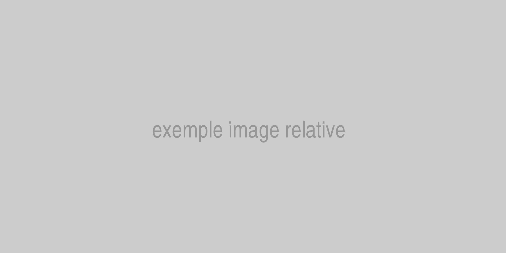

## Style

### Les titres

1 page = 1 titre principal `h1`.

Dans le blog, le `h1` est le titre de l'article. Dans le corps de l'article, on commence donc par des `h2`.

##h2 laceat quas odio atque molestiae
###h3 laceat quas odio atque molestiae
####h4 laceat quas odio atque molestiae
#####h5 laceat quas odio atque molestiae
######h6 laceat quas odio atque molestiae

### Le sommaire
Le sommaire permet d'afficher les `h2` et les `h3` présents dans l'article. Selon le besoin, précisez le niveau de titre à faire figurer au sommaire.

```yaml
tableOfContent: true
# identique à:
# tableOfContent: 2
```
ou
```yaml
tableOfContent: 3
```

### Les éléments typographiques

Nous avons des paragraphes, [des liens](https://www.elao.com/), parfois du `code inline`.

- des listes de choses
- des listes de choses
- des listes de choses

> Nous avons aussi des citations.
> <cite>- Jane Doe</cite>

Un coup sur deux, on a un style différent de citation, sinon on s'ennuie.

> Quoi ? Un deuxième style de citation ? Eos officia, vel corporis eaque architecto eveniet voluptatibus, ullam impedit excepturi quis quidem sint facere laboriosam harum error esse iusto. Asperiores, placeat.
> <cite>John Doe</cite>

Lorem ipsum dolor sit amet, consectetur adipisicing elit, sed do eiusmod
tempor incididunt ut labore et dolore magna aliqua. Ut enim ad minim veniam,
quis nostrud exercitation ullamco laboris nisi ut aliquip ex ea commodo
consequat. Duis aute irure dolor in reprehenderit in voluptate velit esse
cillum dolore eu fugiat nulla pariatur.

!!! Titre
    Nous avons des `admonition` pour les [informations](https://www.elao.com) à faire ressortir.

Excepteur sint occaecat cupidatat non
proident, sunt in culpa qui officia deserunt mollit anim id est laborum.

!!! success "Titre"
    Le même [composant](https://www.elao.com) dans le style "success".

Excepteur sint occaecat cupidatat non
proident, sunt in culpa qui officia deserunt mollit anim id est laborum.

!!! danger "Titre"
    Le même [composant](https://www.elao.com) dans le style "danger".

### Les notes de bas d'article

Les notes se déclarent dans le header de l'article et s'affichent en fin de page, sous leur titre. On les appelle depuis le texte avec `[^…]`, ce qui produit un exposant lié à la note — et un lien de retour vers le point d'appel.

Quatre façons d'appeler une note, toutes rendues ici : par son numéro absolu[^1], par sa clé[^rgaa], par sa position dans un groupe[^lectures:1], ou par sa clé dans un groupe[^lectures:typochef].

```md
par son numéro absolu[^1], par sa clé[^rgaa],
par sa position dans un groupe[^lectures:1], ou par sa clé dans un groupe[^lectures:typochef].
```

Remarquez que `[^lectures:1]` s'affiche `[3]` : la numérotation est continue d'un groupe à l'autre. Les titres découpent l'affichage, ils ne renumérotent pas — sinon deux exposants `[1]` cohabiteraient sans qu'on sache lequel suivre.

Préférez les clés aux numéros : elles survivent au réordonnancement de la liste. Un appel qui ne correspond à aucune note reste affiché tel quel plutôt que de pointer vers une ancre inexistante.

```yaml
footnotes:
  - title: "Sources"        # facultatif : « Notes et références » par défaut
    key:   "sources"        # facultatif : autorise les appels [^sources:…]
    notes:
      - { key: "typo", text: "Conventions typographiques", url: "https://…", source: "Wikipédia" }
  - title: "Pour aller plus loin"
    key:   "lectures"
    notes:
      - { key: "median", text: "« Féminiser au point médian »", url: "http://…" }
```

Si un seul bloc suffit, une simple liste de notes fait l'affaire : ni `title` ni `notes:`, et le titre par défaut s'applique.

```yaml
footnotes:
  - { text: "Conventions typographiques", url: "https://…", source: "Wikipédia" }
```

### Les images

Une image (qui a du sens, ça n'inclut pas les gifs rigolos) a toujours une légende, et si possible on crédite son auteur·ice.

<figure>
    
    <figcaption>
      <span class="figure__legend">David sous l'eau 🐬</span>
      <span class="figure__credits">Crédit photo : <a href="https://unsplash.com/@jbsinger1970">Jonathan Singer</a></span>
    </figcaption>
</figure>

```html
<!-- Comme ceci -->
<figure>
    
    <figcaption>
      <span class="figure__legend">Photo de ...</span>
      <span class="figure__credits">Crédit photo : <a href="">Nom de l'auteur</a></span>
    </figcaption>
</figure>
```

Pour les autres images, utilisez simplement la syntaxe Markdown classique (_cf sections suivantes_).

#### Images retina

Les images inclues dans un contenu sont automatiquement adaptée et fournies en version rétina et non-rétina lorsque cela le permet.

##### Depuis la racine du projet


```md

```

##### Avec un chemin relatif au contenu (recommandé)



```md

```

!!! info ""
    Les GIFs ne peuvent être redimensionnés mais peuvent tout de même être référencés


```md

```

### Le code

Pensez à préciser dans le markdown le langage dans lequel est votre code, si vous voulez des couleurs ! 🌈

```
<html>
  <head></head>
  <body>
    Oups
  </body>
</html>
```

```html
<html>
  <head></head>
  <body>
    C'est mieux
  </body>
</html>
```

### Bonus

Comme toujours, on essaie tant que possible de choisir des photos libres de droit et d'en créditer les auteurs. Quelques sites de photos libres de droit : [Unsplash](https://unsplash.com/) (chouchou ❤️), [Pexels](https://www.pexels.com/), etc.

Pour créditer l'auteur de la photo de couverture, renseignez la clé `credits` dans le header de l'article :

```yaml
credits: { name: 'Jane Doe', url: 'https://unsplash.com/@janedoe' }
```

## Quelques règles typographiques

### Ponctuation
* Les signes simples comme `,` et `.` ne sont précédés d'aucune espace ;  
*Exemple : Je suis contente, aujourd'hui il fait grand soleil, ça faisait longtemps que ça n'était pas arrivé.*
* Les signes doubles comme `!` , `?` , `;` , `:`, `«`, `»` sont toujours entourés de deux espaces ;  
  *Exemple : Bonjour, comment vas-tu ? Je suis contente de te revoir !*
* **Cette règle ne fonctionne pas en anglais** où le signe double n'a pas d'espace avant *(Hello!)*. 
* Attention à bien utiliser les vrais points de suspension `…` et non 3 points à la suite `...` . Sur Mac, <kbd>⌥ alt</kbd> + <kbd>.</kbd>
* Les points de suspension sont suivis d'une espace ; 
* Préférez les guillemets français pour vos citations : `« »`. Sur Mac, <kbd>⌥ alt</kbd> + <kbd>è</kbd> et  <kbd>⌥ alt</kbd> + <kbd>⇧ maj</kbd> + <kbd>è</kbd>. 

### Unités
* Toutes les unités suivant une valeur doivent avoir une espace insécable qui les précède ;  
*Exemple : **10 %** et non ~~10%~~, **10 h** et non ~~10h~~, **10 €** et non ~~10€~~, **10 km** et non ~~10km~~.*
* En français, cela marche avec absolument toutes les unités. On écrira donc plutôt "**10 km / h**" et non "~~10km/h~~" ;
* Cette règle ne fonctionne pas en anglais où l'on accole l'unité à la valeur (10$ ou $10) ;
* Les abréviations d'unités ne sont jamais mises au pluriels : ~~10 kms~~, ~~10 cms~~.

### Utiliser les bonnes abréviations
Souvent, les abréviations officielles sont assez méconnues. En voici quelques-unes : 
* **M.** et non ~~Mr~~;
* **Mme** ;
* **Mlle** et non ~~Melle~~ ;
* **10 min** et non ~~10 mn~~;
* **10 h** et non ~~10 hr~~;
* **1er, 1re, 2e, 3e, 4e** et non ~~1ère~~, ~~2eme~~ ou ~~2ème~~ ; 
* **15 Mo, 15 Go, 15 To** et non ~~15mb~~, ~~15gb~~, ~~15tb~~.

### Faut-il un point à la fin d'une abréviation ?
Une abréviation est suivie d’un point, sauf :
* les abréviations des unités de mesure, pour lesquelles le point n’est jamais utilisé ;
* les abréviations construites en conservant la dernière lettre du mot : *« bd » pour boulevard*.
Autre cas particulier : il faut inclure un espace dans l'abréviation de Nota Bene, `N. B.`

### Nombres
Le séparateur de millier est l’espace insécable, le séparateur de décimale est la virgule.  
*Exemple : « Le solde est de 3 586,12 euros ».*

### Listes
#### Listes à puces
Les items d'une liste à puces commencent toujours avec une majuscule et finissent par un point-virgule, sauf le dernier qui se termine par un point.  

*Exemple :*  
Pour se sentir mieux :
- Pensez à faire des pauses plusieurs fois dans la journée ; 
- Levez les yeux de votre écran plusieurs fois par heure ; 
- Évitez de consommer trop d'excitants (café, thé, etc.).

**N. B. : la règle étant à la base pour l'édition de documents imprimés, il est admis pour les présentations et interfaces web de ne pas surcharger et de ne pas suivre la règle des ponctuations de liste. Mais si vous souhaitez en mettre, c'est cette règle qu'il faut suivre.**

#### Listes numérotées
Les items d'une liste numérotée commencent toujours avec une majuscule et finissent par un point.  

*Exemple :*  
Les valeurs d'Elao sont :
1. L'humain avant tout. 
2. Rester humbles et apprendre de nos erreurs.
3. S’ouvrir, partager, ne rien garder pour soi.

#### L'emploi du "etc"
Quand on fait une liste qui se termine par "etc", celui-ci est précédé d'une virgule et suivi d'un point. Il n'est JAMAIS suivi de points de suspension "~~etc...~~".  
*Exemple : « Pensez à acheter des fruits : pommes, bananes, clémentines**, etc.** »*

### D'autres petites règles bien utiles

* Dans le web, l'usage du __souligné__ est utilisé strictement pour signifier un lien. Pour mettre l'emphase sur un mot, préférez le gras.
* Il est inutile de mettre un point final `.` à un titre ;
* Il est inutile de mettre deux points `:` après un titre ou un `label` de formulaire, puisqu'ils introduisent toujours leur sujet, c'est redondant ;
* Les `et` ne doivent jamais être précédés d'une virgule, sauf dans des cas exceptionnels comme l'énumération ;
* L’usage du mot « **Éditer** » pour « Modifier » est incorrect. Éditer, c’est « publier, diffuser », non « corriger » ;
* L'usage du mot « **Adresser** » pour « Traiter » est incorrect. En français, « adresser » signifie « envoyer », « émettre des paroles », ou « diriger quelqu’un vers la personne qui convient », par exemple *adresser un malade à un spécialiste*. On ne dira donc pas « Adresser un problème/sujet » mais plutôt « Traiter », « Aborder », « S'attaquer à » ;
* L'adjectif « Transverse » est un anglicisme. On lui préfère sa traduction française « Transversal » ;
* Les guillemets servent à citer quelqu’un et **c’est tout**, jamais à insister sur un mot ni à couvrir une approximation ;
*Exemple : gérer un projet en mode “agile” ou “classique” => gérer un projet en mode agile ou classique* ;
* Accentuez les majuscules ! Cela rend la lecture plus facile. Sur Mac, il suffit d'activer le capslock avant d'appuyer sur la touche à accentuer. 

### L'écriture inclusive
Si vous souhaitez être inclusif·ve dans votre rédaction, voici quelques solutions possibles pour que cela reste lisible en fonction du contexte.
Chacun est libre, en tant qu'auteur en son nom propre, de l'utiliser ou non lors de la rédaction de son article. 

Nous les présentons ici par ordre de préférence dans leur mise en application sur le blog, mais il est à votre discrétion d'utiliser la formule la plus adaptée en fonction du contexte.

#### Utiliser des formules non genrées (épicène)
*Exemple 1 : « L'ensemble de l'équipe doit faire sa demande de congés sur Lucca. »*  
*Exemple 2 : « Bonjour tout le monde ! »*

#### Doubler au féminin la formule masculine
*Exemple 1 : « Chaque employé et employée doit faire sa demande de congés sur Lucca. »*  
*Exemple 2 : « Bonjour à toutes et à tous ! »*

#### Utiliser le point médian
*Exemple 1 : « Chaque employé·e doit faire sa demande de congés sur Lucca. »*  
*Exemple 2 : « Bonjour à tou·te·s ! »*

Pour faire un point médian :  
Sur Mac : <kbd>⌥ alt</kbd> + <kbd>⇧ maj</kbd> + <kbd>F</kbd> ;  
Sur PC : <kbd>Alt</kbd>+<kbd>0183</kbd> ou <kbd>Alt</kbd>+<kbd>00B7</kbd>.

### Pour aller plus loin
Quelques ressources intéressantes :
* La page Wikipédia des [Conventions typographiques](https://fr.wikipedia.org/wiki/Wikip%C3%A9dia:Conventions_typographiques) ; 
* L'article [« Féminiser au point médian »](http://romy.tetue.net/feminiser-au-point-median) ;
* Suivez [TypoChef](https://twitter.com/typochef) sur Twitter.
