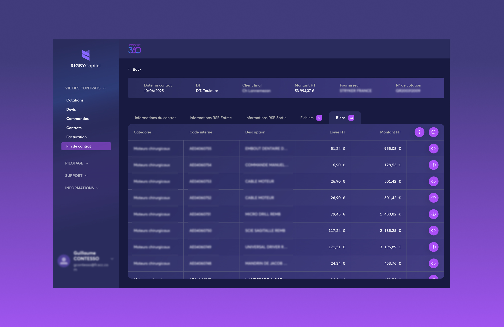
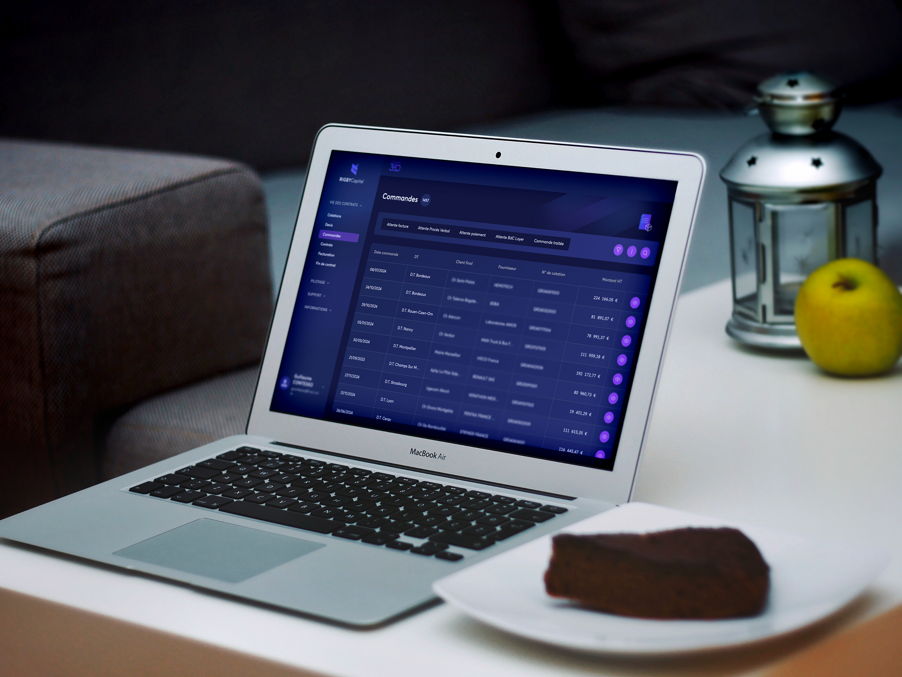
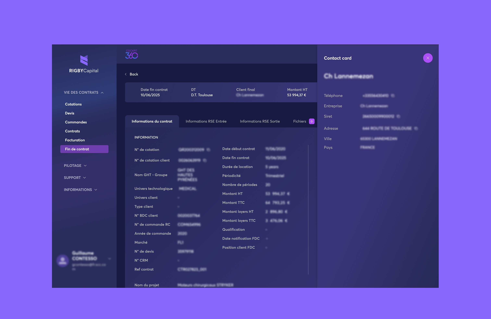
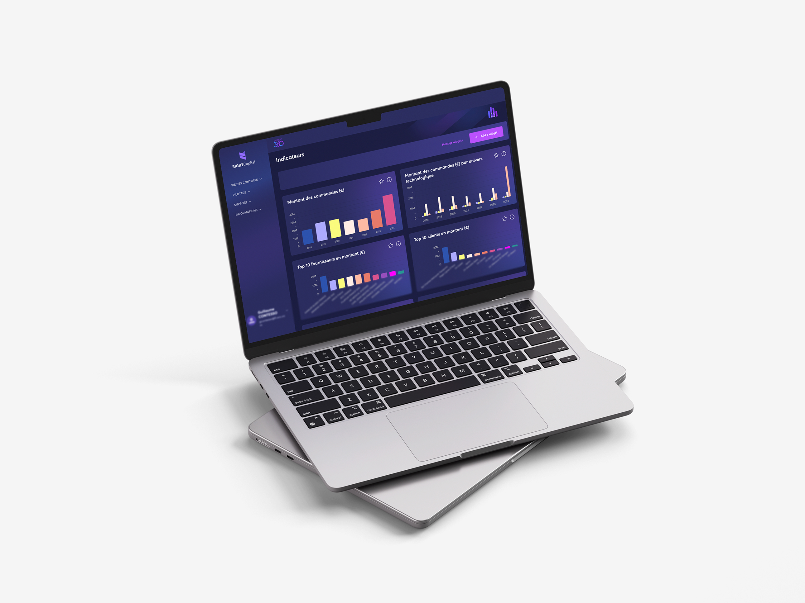

## Le contexte du projet

[RIGBY Capital](https://www.rigbycapital.com/fr/), entreprise spécialisée dans **les
solutions de financement** et dans **la gestion d'actifs** (technologiques, industriels, informatiques etc.) a fait
appel à Elao afin de l'accompagner dans le développement de son **application web**, "Cockpit 360".

Nous avons initié notre collaboration en prenant en charge **l'accompagnement des équipes techniques et métiers** de
RIGBY Capital. Notre mission consistait à **structurer**, **animer** et **faciliter** le projet en orchestrant les interactions
entre les équipes RIGBY Capital et les partenaires externes.
Par la suite, en réponse à un besoin exprimé par RIGBY Capital, Elao a pris en charge **l'intégralité du développement front-end
** du projet.

Aujourd'hui, nous accompagnons toujours l'équipe RIGBY Capital dans le développement des fonctionnalités du Cockpit 360 et dans
l'animation du projet.

## L'expertise Elao déployée pour Cockpit 360

C'est un fait, pour qu'un projet voit le jour, il est primordial de l'animer et de le structurer. Pour ce faire, notre
équipe de facilitateur·rice est intervenu·e dès l'été 2023 pour accompagner les équipes métiers et techniques de RIGBY
Capital. L'objectif a été de **construire ensemble les process du projet** afin de le faire avancer et de **répondre aux
objectifs fixés**.
Pour cela, nous avons entre autres :

- Redéfini le rôle de chacun ainsi que les outils
- Conçu des microformations pour faire monter en compétence la Product Owner côté RIGBY Capital
- Ritualisé les échanges (deux daily par semaine avec l'équipe tech puis un échange avec l'équipe métier)
- Animé les réunions et ateliers projets
- Conçu ensemble les différentes itérations du projet

Bien que ce rôle d'accompagnateur a su persister, il a également évolué, puisqu'une équipe tech côté Elao a rejoint le
projet. Notre mission a alors été de développer tout le front de l'applicatif tout en continuant l'animation du projet.
Cette mission s'est articulée à travers plusieurs phases 👇

### Phase d'audit

Cette phase s'est inscrite par la volonté de RIGBY Capital de faire intervenir des profils qualifiés à la **conception et
ingénierie logicielle**, avec une **expertise React** ; ce que ne proposait pas leur précédent
intégrateur, avec lequel ils ont fait les
maquettes et l'intégration initiale des pages ainsi que les composants de l'application.

La mission a débuté par une **analyse du code existant**, préalablement produit par un tiers, une **revue
d'architecture** et de **qualité de code**, l'identification des soucis de conceptions et/ou de performances et des
recommandations.

L'idée était de préparer le terrain et de se mettre d'accord sur un premier périmètre d'intervention. Côté Elao, il
s'agissait de s'assurer que nous étions à même de pouvoir et vouloir reprendre le projet, en vérifiant qu'il pouvait s'
inscrire efficacement dans nos pratiques. Côté RIGBY Capital, c'était un moyen de se rassurer quant à la qualité du code produit
jusqu'alors (la base était bonne, et le projet pouvait se poursuivre sans encombre sans engager de refonte profonde) et
d'obtenir des retours constructifs et des recommandations techniques pour la suite.

### Phase de qualification

Suite à cet "audit" et l'établissement d'un premier périmètre, une première intervention d'Elao a eu lieu pour refondre
**les listings et la communication** entre le **front React et l'API**, afin d'obtenir les performances, généricité et
réactivité souhaitées sur l'ensemble des fonctionnels liés.
En parallèle, nous avons mis en place des **outils de qualité de code** adaptés et le socle applicatif migré de CRA (
Create React App, aujourd'hui déprécié) vers un bundler moderne (Vite).

<figure>
    
    <figcaption>
      Exemple de listing
    </figcaption>
</figure>

### Phase de build

Cette première intervention validée, nous avons pu entrer dans une phase de collaboration plus intensive et faire monter
d'autres personnes dans l'équipe Elao (Amélie et Arthur) pour **accompagner l'équipe back RIGBY Capital sur la suite des
fonctionnels**.

## L'application

L'application consiste à rendre accessible un ensemble de données à la consultation (pas de modification), au travers
d'une **interface** sur laquelle l'utilisateur doit avoir un **contrôle et une personnalisation assez fine**.

### L'API : le coeur de l'application

Le coeur du métier et de l'application est son API, laquelle **modélise** et **structure** l'ensemble des données et
interactions possibles avec l'interface, de façon suffisamment générique pour s'adapter à tous les **jeux de données**,
et être capable de piloter entièrement le rendu et les fonctionnalités exposées sur le front.

Chaque filtre de recherche, agencement de colonne, onglets et actions disponibles à l'écran sont définis par l'API et
notre travail côté front est alors d'implémenter les composants répondant aux spécifications pour s'adapter à toutes les
situations.

<figure>
    
    <figcaption>
      Exemple d'agencement de colonnes
    </figcaption>
</figure>

### Un contexte d'intervention peu commun pour Elao

Le contexte d'intervention pour Elao n'était pas tout à fait habituel.
Nous avons pour habitude de mener nos applications de bout en bout, et d'avoir les mains à la fois côté back et côté
front.
Ici, nous n'intervenions que sur le front, et une bonne partie du back nous était opaque. La surface visible pour nous,
l'interface, c'est l'API (GraphQL).
Si nous n'intervenons pas directement dans son développement, il est important de la **comprendre** et de s'assurer qu'
elle soit en **accord** avec les fonctionnalités attendues sur le front.

À Elao, nous développons depuis plusieurs années la plupart de nos applications de façon à communiquer au travers d'une
**API GraphQL**. Ainsi, nous avons une connaissance approfondie de comment architecturer une application front, avec
**[React](../term/react.md)** et **Apollo** (un client GraphQL). Ce dernier possède un mécanisme de cache des données puissant (on en parle
juste [ici](../blog/dev/apollo-graphql-cache.md)), qu'il est essentiel de comprendre pour bénéficier des
meilleures performances et capacités à faire évoluer une application avec de nombreuses interrogations / manipulations 
de données.

Aussi, nous avons eu une étroite collaboration avec l'équipe back pour s'assurer que l'API puisse répondre de la façon
la plus adaptée à ce que le front puisse bénéficier de ces mécanismes pour répondre au mieux aux exigences de l'
application.

Néanmoins, le fait d'avoir 2 équipes front et back bien distinctes est un challenge, et il n'est pas toujours évident de
**synchroniser** nos travaux (nous l'évoquons dans
notre [post Linkedin sur Apollo - Local resolvers](https://www.linkedin.com/posts/elao_frontend-backend-api-activity-7216352458766254081-wzjR/)).
Lorsque l'une ou l'autre des équipes accuse du retard, il faut mettre
en œuvre toutes nos compétences organisationnelles et techniques, et tâcher de trouver des solutions pour avancer au
mieux. Cela passe par la mise en oeuvre de solutions purement techniques, palliatives et temporaires ou de communication
avec des étapes de **spécification** et **rédaction de contrats API**, qu'il n'est pas alors nécessaire d'implémenter
entièrement, mais dont la signature puisse être suffisante pour avancer.

### Ce que comporte le projet

Nous l'avons indiqué plus haut, l'application repose sur son API qui définie le cœur de l'application, mais finalement
de quoi est fait Cockpit 360 ?

Le projet repose sur un principe de **listings générique de données**, chaque liste possédant une configuration 
côté back qui est retournée par l'API pour :

- choisir le modèle et source de données à afficher
- choisir les colonnes à afficher et permettre leur réagencement
- appliquer des **tris**
- faire une **recherche textuelle**
- effectuer des **filtres rapides** (système de boutons radio en haut de liste)
- effectuer des **filtres avancés**. Chaque modèle étant différent, ces filtres sont également construits dynamiquement
  en fonction d'une configuration retournée par l'API.
- faire des exports

Qui dit listing de données, dit pages détails. De la même façon que les listings, nous avons mis en place des vues de
détails en proposant une structure générique et dont le fonctionnel est piloté par la configuration retournée par l'API.
Nous sommes intervenus sur :

- des **systèmes d'onglet**, avec des fonctionnalités propres :
    - des informations détaillées de l'objet en cours de visualisation
    - des objets liés au travers d'un onglet embarquant un listing (ex: contrats d'un bien) et toutes ses
      fonctionnalités (tri, recherche, filtres, …)
    - un export

<figure>
    
    <figcaption>
      Exemple d'un onglet imbriqué
    </figcaption>
</figure>

Également, nous avons pris part à la création de **rapports personnalisés** afin de permettre à l'utilisateur de choisir
un listing, **configurer ses colonnes et ses filtres,** ainsi que **sauvegarder la représentation** pour procéder à des
**exports réguliers**.

Enfin, une partie **suivi des métriques** au travers d'un espace de création d'indicateurs graphiques (pie chart, bar
charts, KPI, ...) pour toutes les sources de données a été mis en place.

<figure>
    
    <figcaption>
      Exemple de métriques
    </figcaption>
</figure>

### En résumé

Cette collaboration avec **RIGBY Capital** illustre plutôt bien la valeur ajoutée d’un accompagnement structuré et d’un 
développement front‑end optimisé. Grâce à l’audit initial, réalisé en première phase, nous avons pu identifier et 
corriger ensemble les enjeux de performances et de qualité issus de l’intégration existante, sans recourir à une refonte
complète.

La migration vers _Vite_, la mise en place d’outils de qualité et l’optimisation des échanges front/back (notamment via 
GraphQL) ont permis de renforcer la réactivité et la robustesse de l’application.

Enfin, l’accompagnement continu et l’animation projet a permis d’insuffler une dynamique de collaboration durable entre
les équipes RIGBY Capital et Elao.
